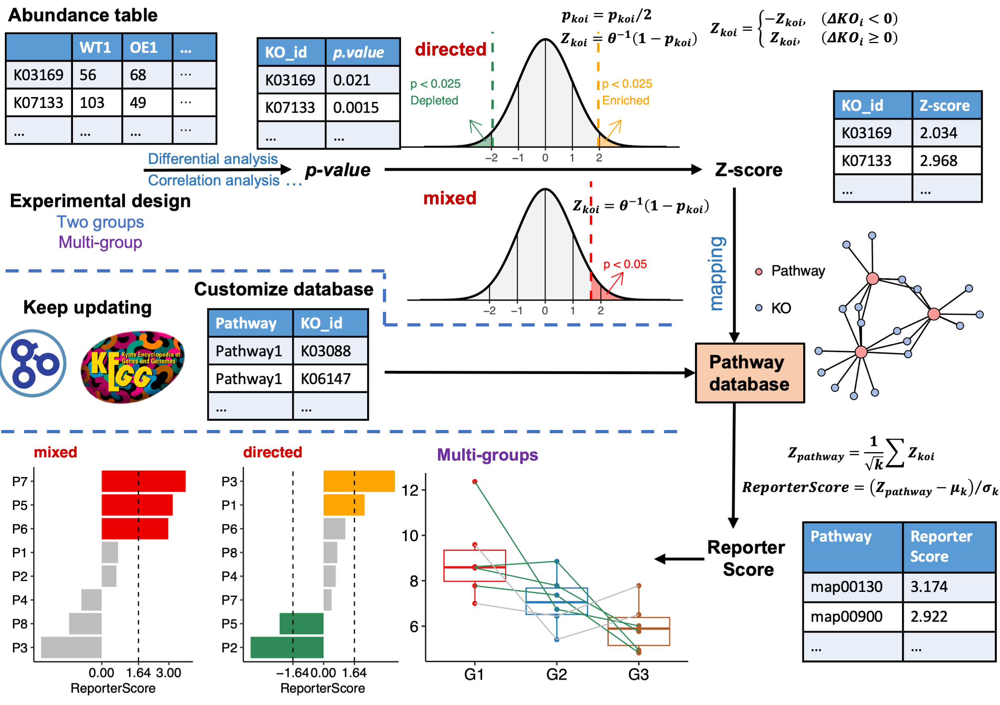
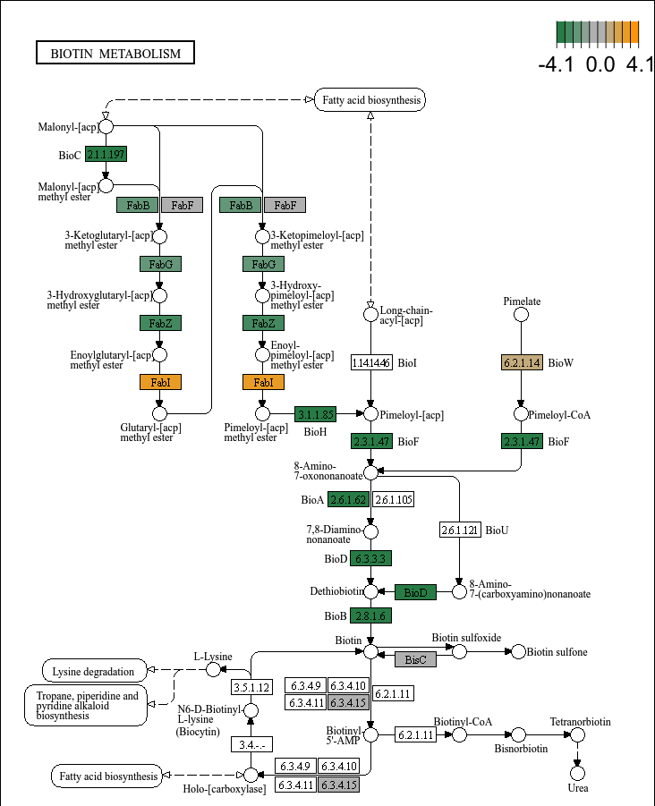

---
output:
  github_document:
    html_preview: false
---

<!-- README.md is generated from README.Rmd. Please edit that file -->

```{r, include = FALSE}
knitr::opts_chunk$set(
  collapse = TRUE,
  comment = "#>",
  cache = TRUE,
  fig.path = "man/figures/README-",
  out.width = "100%",
  dpi = 300
)
devtools::load_all("~/Documents/R/GRSA/ReporterScore/")
library(badger)
```

```{r include=FALSE,eval=FALSE}
library(hexSticker)
showtext::showtext_auto()
sticker("~/Documents/R/test/icons/enrichment.png",
  package = "ReporterScore",
  p_size = 17, p_color = "#0C359E", p_y = 1.4,
  p_fontface = "bold.italic", p_family = "Comic Sans MS",
  s_x = 1, s_y = .75, s_width = 0.6, s_height = 0.6,
  h_fill = "#F6F5F5", h_color = "#2D9596",
  filename = "man/figures/ReporterScore.png", dpi = 300
)
```

# ReporterScore 

<!-- badges: start -->
[](https://github.com/Asa12138/ReporterScore/actions/workflows/R-CMD-check.yaml)
`r badger::badge_doi("10.1093/bib/bbae116","yellow")`
`r badge_custom("blog", "@asa", "blue", "https://asa-blog.netlify.app/")`
`r badge_cran_download("ReporterScore", type = "grand-total")`
`r badge_cran_download("ReporterScore", type = "last-month")`
`r badge_cran_release("ReporterScore","green")`
`r badge_devel("Asa12138/ReporterScore", color = "green")`
<!-- badges: end -->

Inspired by the classic 'RSA', we developed the improved 'Generalized Reporter 
Score-based Analysis (GRSA)' method, implemented in the R package 'ReporterScore', along 
with comprehensive visualization methods and pathway databases. 

'GRSA' is a threshold-free method that works well with all types of biomedical features, such as genes, chemical compounds, 
and microbial species. Importantly, the 'GRSA' supports **multi-group and longitudinal experimental 
designs**, because of the included multi-group-compatible statistical methods. 

```{r echo=FALSE}

```

The HTML documentation of the latest version is available at [Github page](https://asa12138.github.io/ReporterScore/).

## Citation

To cite ReporterScore in publications use:

C. Peng, Q. Chen, S. Tan, X. Shen, C. Jiang, Generalized Reporter Score-based Enrichment Analysis for Omics Data. _Briefings in Bioinformatics_ (2024). <https://doi.org/10.1093/bib/bbae116>.

## Installation

You can install the released version of `ReporterScore` from [CRAN](https://CRAN.R-project.org) with:

``` r
install.packages("ReporterScore")
```

You can install the development version of `ReporterScore` from [GitHub](https://github.com/) with:

``` r
# install.packages("devtools")
devtools::install_github("Asa12138/pcutils")
devtools::install_github("Asa12138/ReporterScore")
```

## Usage

### 1. Inputdata (Feature abundance table and metadata)

- For transcriptomic, scRNA-seq, and related gene-based omics data of a specific species, a complete gene abundance table can be used. 
- For metagenomic and metatranscriptomic data, which involve many different species, a KO abundance table can be used, generated using Blast, Diamond, or KEGG official mapper software to align the reads or contigs to the KEGG or the EggNOG database 
- For metabolomic data, an annotated compound abundance table can be used, but the standardization of compound IDs (e.g., convert compound IDs to C numbers in the KEGG database) is required.

⚠️**Importantly, the input data should not be prefiltered to retain the background information. As 'GRSA' is a threshold-free method**

Format of abundance table: 
- The rowname are feature ids (e.g. "K00001" (KEGG K number) if feature="ko"; "PEX11A" (gene symbol) if feature="gene"; "C00024" (KEGG C number) if feature="compound").
- The colnames are samples. 
- The abundance value can be read counts or normalized values (e.g., TPM, FPKM, RPKM, or relative abundance, corresponds to suitable statistical test method).

An example code tailored for a KO abundance table is as follows:

```{r}
data("KO_abundance_test")
head(KO_abundance[, 1:6])
```

And you should also offer a experimental metadata:

Format of metadata table: 
- The rows are samples, columns are groups
- The grouping variable can be categories (at least two categories, for differential abundance analysis) 
- The grouping variable can also be multiple time points (for longitudinal analysis)
- The grouping variable can also be continuous (for correlation analysis)

```{r}
head(metadata)
```

### 2. Pathway databases

The `ReporterScore` package has built-in KEGG pathway, module, gene, compound, and GO databases and also allows customized databases, making it compatible with feature abundance tables from diverse omics data.

1. `ReporterScore` has built-in KEGG pathway-KO and module-KO databases (2023-08 version) for KO abundance table. You can use `load_KOlist()` to have a look and use `update_KO_file()` to update these databases (by KEGG API) as using latest database is very important.

2. `ReporterScore` has built-in KEGG pathway-compound and module-compound databases (2023-08 version) for compound abundance table. You can use `load_CPDlist()` to have a look and use `update_KO_file()` to update these databases (by KEGG API).

3. `ReporterScore` has built-in pathway-ko, pathway-gene, and pathway-compound databases of human (hsa) and mouse (mmu) for ko/gene/compound abundance table. You can use `custom_modulelist_from_org()` to have a look. Use `update_org_pathway()` to update these databases and download other organism databases (by KEGG API).

4. `ReporterScore` has built-in GO-gene database, You can use `load_GOlist()` to have a look and use `update_GOlist()` to update these databases (by KEGG API).

5. You can just customize your own pathway databases (gene set of interest) by using `custom_modulelist()`.

```{r eval=FALSE}
# 1. KEGG pathway-KO and module-KO databases
KOlist <- load_KOlist()
head(KOlist$pathway)

# 2. KEGG pathway-compound and module-compound databases
CPDlist <- load_CPDlist()
head(CPDlist$pathway)

# 3. human (hsa) pathway-ko/gene/compound databases
hsa_pathway_gene <- custom_modulelist_from_org(
  org = "hsa",
  feature = c("ko", "gene", "compound")[2]
)
head(hsa_pathway_gene)

# 4. GO-gene database
GOlist <- load_GOlist()
head(GOlist$BP)

# 5. customize your own pathway databases
?custom_modulelist()
```

### 3. One step GRSA

Use function `GRSA` or `reporter_score` can get the reporter score result by one step.

⚠️There are some important arguments for analysis:

-   **mode**: "mixed" or "directed" (directed mode only for two groups differential analysis or multi-groups correlation analysis.), see details in `pvalue2zs`.
-   **method**: the method of statistical test for calculating p-value. Default is `wilcox.test`:
    -   `t.test` (parametric) and `wilcox.test` (non-parametric). Perform comparison between two groups of samples.
    -   `anova` (parametric) and `kruskal.test` (non-parametric). Perform one-way ANOVA test or Kruskal-Wallis rank sum test comparing multiple groups.
    -   "pearson", "kendall", or "spearman" (correlation), see `?cor`.
    -   "none": use "none" for `step by step enrichment`. You can calculate the p-value by other methods like "DESeq2", "Edger", "Limma", "ALDEX", "ANCOM" yourself.
-   **type**: choose the built-in pathway database:
    -   'pathway' or 'module' for default KEGG database for **microbiome**.
    -   'CC', 'MF', 'BP', 'ALL' for default GO database for **homo sapiens**.
    -   org in listed in <https://www.genome.jp/kegg/catalog/org_list.html> such as 'hsa' (if your kodf is come from a specific organism, you should specify type here)
-   **modulelist**: customize database. A dataframe containing 'id','K_num','KOs','Description' columns. Take the `KOlist` as example, use `custom_modulelist` to build a customize database.
-   **feature**: one of "ko", "gene", "compound".

**The first level will be set as the control group, you can change the factor level to change your comparison.**

For example, we want to compare two groups 'WT-OE', and use the "directed" mode as we just want know which pathways are enriched or depleted in **OE group**:

#### KO-pathway

```{r collapse=TRUE}
cat("Comparison: ", levels(factor(metadata$Group)), "\n")

# for microbiome!!!
reporter_res <- GRSA(KO_abundance, "Group", metadata,
  mode = "directed",
  method = "wilcox.test", perm = 999,
  type = "pathway", feature = "ko"
)
```

The result is a "reporter_score" object:

|  elements    |  description                                      |
|--------------|---------------------------------------------------|
| `kodf`       | your input KO_abundance table                     |
| `ko_stat`    | ko statistics result contains p.value and z_score |
| `reporter_s` | the reporter score in each pathway                |
| `modulelist` | default KOlist or customized modulelist dataframe |
| `group`      | The comparison groups in your data                |
| `metadata`   | sample information dataframe contains group       |

#### Gene-pathway

When you use the gene abundance table of a specific species (e.g. human), remember to set the `feature` and `type`!!! Or give the database through `modulelist`.

```{r }
data("genedf")

# Method 1: Set the `feature` and `type`!
reporter_res_gene <- GRSA(genedf, "Group", metadata,
  mode = "directed",
  method = "wilcox.test", perm = 999,
  type = "hsa", feature = "gene"
)
```

```{r eval=FALSE}
# Method 2: Give the database through `modulelist`, same to Method 1.
hsa_pathway_gene <- custom_modulelist_from_org(
  org = "hsa",
  feature = "gene"
)

reporter_res_gene <- GRSA(genedf, "Group", metadata,
  mode = "directed",
  method = "wilcox.test", perm = 999,
  modulelist = hsa_pathway_gene
)
```

```{r fig.width=10,fig.height=8}
library(patchwork)
p1 <- plot_report_bar(reporter_res_gene, rs_threshold = 2)

# Use `modify_description` to remove the suffix of pathway description
reporter_res_gene2 <- modify_description(reporter_res_gene, pattern = " - Homo sapiens (human)")
p2 <- plot_report_bar(reporter_res_gene2, rs_threshold = 2)

# Use `ggplot_translator` to translate pathway description
p3 <- pcutils::ggplot_translator(p2)

p1 / p2 / p3
```


#### Compound-pathway

When you use the compound abundance table, remember to set the `feature` and `type`!!! Or give the database through `modulelist`.

```{r eval=FALSE}
reporter_res_gene <- GRSA(chem_df, "Group", metadata,
  mode = "directed",
  method = "wilcox.test", perm = 999,
  type = "hsa", feature = "compound"
)
```

### 4. Visualization

After we get the reporter score result, we can visualize the result in various ways.

When we focus on the whole result:

- Plot the most significantly enriched pathways:

You can set the `rs_threshold` to filter the pathways, the default `rs_threshold` is 1.64, which is be considered as significant at the 0.05 level.

```{r fig.height=7,fig.width=12}
# View(reporter_res$reporter_s)
plot_report_bar(reporter_res, rs_threshold = c(-2.5, 2.5), facet_level = TRUE)
```

⚠️**In the directed mode, Enriched in one group means depleted in another group.**

- Plot the most significantly enriched pathways (circle packing):

```{r fig.height=7}
plot_report_circle_packing(reporter_res, rs_threshold = c(-2.5, 2.5))
```


When we focus on one pathway, e.g. "map00780":

- Plot boxes and lines

```{r}
plot_KOs_in_pathway(reporter_res, map_id = "map00780")
```

- Plot the distribution of Z-scores

```{r}
plot_KOs_distribution(reporter_res, map_id = "map00780")
```

- Plot as a network:

```{r}
plot_KOs_network(reporter_res,
  map_id = c("map00780", "map00785", "map00900"),
  main = "", mark_module = TRUE
)
```

- Plot the KOs abundance in a pathway:

```{r fig.height=7,fig.width=8}
plot_KOs_box(reporter_res, map_id = "map00780", only_sig = TRUE)
```

- Plot the KOs abundance in a pathway (heatmap):

```{r}
plot_KOs_heatmap(reporter_res,
  map_id = "map00780", only_sig = TRUE,
  heatmap_param = list(cutree_rows = 2)
)
```

- Plot the KEGG pathway map:

```{r eval=FALSE}
plot_KEGG_map(reporter_res, map_id = "map00780", color_var = "Z_score")
```

```{r echo=FALSE}

```

### Example for multi-group or longitudinal

If our experimental design is more than two groups or longitudinal, we can choose multi-groups comparison (or correlation):

```{r collapse=TRUE}
cat("Comparison: ", levels(factor(metadata$Group2)))

reporter_res2 <- GRSA(KO_abundance, "Group2", metadata,
  mode = "directed",
  method = "spearman", perm = 999
)

plot_KOs_in_pathway(reporter_res2, map_id = "map02060") + scale_y_log10()
```

### Example for specified pattern

For example, groups “G1”, “G2”, and “G3” can be set as 1, 10, and 100 if an exponentially increasing trend is expected.

We use 1,5,1 to found pathways with the down-up-down pattern

```{r message=FALSE}
reporter_res3 <- GRSA(KO_abundance, "Group2", metadata,
  mode = "directed", perm = 999,
  method = "pearson", pattern = c("G1" = 1, "G2" = 5, "G3" = 1)
)
plot_report_bar(reporter_res3, rs_threshold = 3, show_ID = TRUE)
plot_KOs_in_pathway(reporter_res3, map_id = "map00860")
```

To explore potential patterns within the data, clustering methods, such as C-means clustering, can be used.

```{r message=FALSE}
rsa_cm_res <- RSA_by_cm(KO_abundance, "Group2", metadata,
  method = "pearson",
  k_num = 3, perm = 999
)
# show the patterns
plot_c_means(rsa_cm_res, filter_membership = 0.7)

plot_report_bar(rsa_cm_res, rs_threshold = 2.5, y_text_size = 10)
```

## Details

### Step by step

The one step function `reporter_score` consists of three parts：

```{r add, eval=FALSE}
data("KO_abundance_test")
ko_pvalue <- ko.test(KO_abundance, "Group", metadata, method = "wilcox.test")
ko_stat <- pvalue2zs(ko_pvalue, mode = "directed")
reporter_s1 <- get_reporter_score(ko_stat, perm = 499)
```

1.  `ko.test`: this function help to calculate *p-value* for KO_abundance by various built-in methods such as differential analysis (`t.test`, `wilcox.test`, `kruskal.test`, `anova`) or correlation analysis (`pearson`, `spearman`, `kendall`). **You can also calculate this *p-value* for KO_abundance by other methods** like "DESeq2", "Edger", "Limma", "ALDEX", "ANCOM" and do a p.adjust yourself, then skip `ko.test` step go to step2...
2.  `pvalue2zs`: this function transfers p-value of KOs to Z-score (select mode: "mixed" or "directed").
3.  `get_reporter_score` this function calculate reporter score of each pathways in a specific database. You can use a custom database here.


Take the "Limma" as an example:

```{r add1, eval=FALSE}
# 1-1. Calculate p-value by Limma
ko_pvalue <- ko.test(KO_abundance, "Group", metadata, method = "none")

ko_Limma_p <- pctax::diff_da(KO_abundance, group_df = metadata["Group"], method = "limma")

# 1-2. Replace the p-value in ko_pvalue, remember to match the KO_ids
ko_pvalue$`p.value` <- ko_Limma_p[match(ko_pvalue$KO_id, ko_Limma_p$tax), "pvalue"]

# 2. Use `pvalue2zs` to get Z-score
ko_stat <- pvalue2zs(ko_pvalue, mode = "directed")

# 3. Use `get_reporter_score` to get reporter score
reporter_s1 <- get_reporter_score(ko_stat, perm = 499)

# 4. Combine the result
reporter_res1 <- combine_rs_res(KO_abundance, "Group", metadata, ko_stat, reporter_s1)

# Then the reporter_res1 can be used for visualization
```


### Other commonly used enrichment methods

```{r echo=FALSE}
tibble::tribble(
  ~Category, ~Method, ~Tools, ~Notes,
  "ORA", "Hypergeometric test / Fisher’s exact test", "DAVID (website) [7], clusterProfiler (R package) [8]", "The most common methods used in enrichment analysis. Selecting a list of genes is required.",
  "FCS", "Gene set enrichment analysis (GSEA)", "GSEA (website) [9]", "GSEA creatively uses gene ranking, rather than selecting a list of genes, to identify statistically significant and concordant differences across gene sets.",
  "FCS", "Generalized reporter score-based analysis (GRSA/RSA)", "ReporterScore (R package developed in this study)", "Find significant metabolites (first report), pathways, and taxonomy based on the p-values for multi-omics data.",
  "FCS", "Significance Analysis of Function and Expression (SAFE)", "safe (R package) [10]", "SAFE assesses the significance of gene categories by calculating both local and global statistics from gene expression data.",
  "FCS", "Gene Set Analysis (GSA)", "GSA (R Package) [11]", "GSA was proposed as an improvement of GSEA, using the “maxmean” statistic instead of the weighted sign KS statistic.",
  "FCS", "Pathway Analysis with Down-weighting of Overlapping Genes (PADOG)", "PADOG (R package) [12]", "PADOGA assumes that genes associated with fewer pathways have more significant effects than genes associated with more pathways.",
  "FCS", "Gene Set Variation Analysis (GSVA)", "GSVA (R package) [13]", "A nonparametric, unsupervised method that transforms gene expression data into gene set scores for downstream differential pathway activity analysis.",
  "PT", "Topology-based pathway enrichment analysis (TPEA)", "TPEA (R package) [14]", "Integrate topological properties and global upstream/downstream positions of genes in pathways."
) %>%
  pcutils::gsub.data.frame("\\[\\d+\\]", "", .) %>%
  as.data.frame() %>%
  knitr::kable(caption = "Commonly used enrichment methods for omics data.", format = "simple")
```

`ReporterScore` also provides other enrichment methods like `KO_fisher`(fisher.test), `KO_enrich`(fisher.test, from `clusterProfiler`), `KO_gsea` (GSEA, from `clusterProfiler`).

The input data is from `reporter_score`, and also supports custom databases, so you can easily compare the results of various enrichment methods and conduct a comprehensive analysis:


```{r message=FALSE}
# View(reporter_res2$reporter_s)
# reporter_score
filter(reporter_res$reporter_s, abs(ReporterScore) > 1.64, p.adjust < 0.05) %>% pull(ID) -> RS
# fisher
fisher_res <- KO_fisher(reporter_res)
filter(fisher_res, p.adjust < 0.05) %>% pull(ID) -> Fisher
# enricher
enrich_res <- KO_enrich(reporter_res)
filter(enrich_res, p.adjust < 0.05) %>% pull(ID) -> clusterProfiler
# GESA
set.seed(1234)
gsea_res <- KO_gsea(reporter_res, weight = "Z_score")
filter(data.frame(gsea_res), p.adjust < 0.05) %>% pull(ID) -> GSEA

venn_res <- list(GRSA = RS, Fisher = Fisher, CP = clusterProfiler, GSEA = GSEA)
library(pcutils)
venn(venn_res, "network")
```

## Other features

### uplevel the KOs

[KEGG BRITE](https://www.genome.jp/kegg/brite.html) is a collection of hierarchical classification systems capturing functional hierarchies of various biological objects, especially those represented as KEGG objects.

We collected k00001 KEGG Orthology (KO) table so that you can summaries each levels abundance. Use `load_KO_htable` to get KO_htable and use `update_KO_htable` to update. Use `up_level_KO` can upgrade to specific level in one of "pathway", "module", "level1", "level2", "level3", "module1", "module2", "module3".

```{r fig.height=7,fig.width=10}
KO_htable <- load_KO_htable()
head(KO_htable)
plot_htable(type = "ko")
```

```{r collapse=TRUE}
KO_level1 <- up_level_KO(KO_abundance, level = "level1", show_name = TRUE)
pcutils::stackplot(KO_level1[-which(rownames(KO_level1) == "Unknown"), ]) +
  ggsci::scale_fill_d3() +
  theme(axis.text.x = element_text(angle = 90, hjust = 1, vjust = 0.5))
```

### CARD for ARGs

For convenience, I also included the CARD database from https://card.mcmaster.ca/download/0/broadstreet-v3.2.8.tar.bz2.

```{r}
CARDinfo <- load_CARDinfo()
head(CARDinfo$ARO_index)
```

# Reference

1.  Patil, K. R. & Nielsen, J. Uncovering transcriptional regulation of metabolism by using metabolic network topology.
    Proc Natl Acad Sci U S A 102, 2685--2689 (2005).

2.  L. Liu, R. Zhu, D. Wu, Misuse of reporter score in microbial enrichment analysis. iMeta. 2, e95 (2023).

3.  <https://github.com/wangpeng407/ReporterScore>
