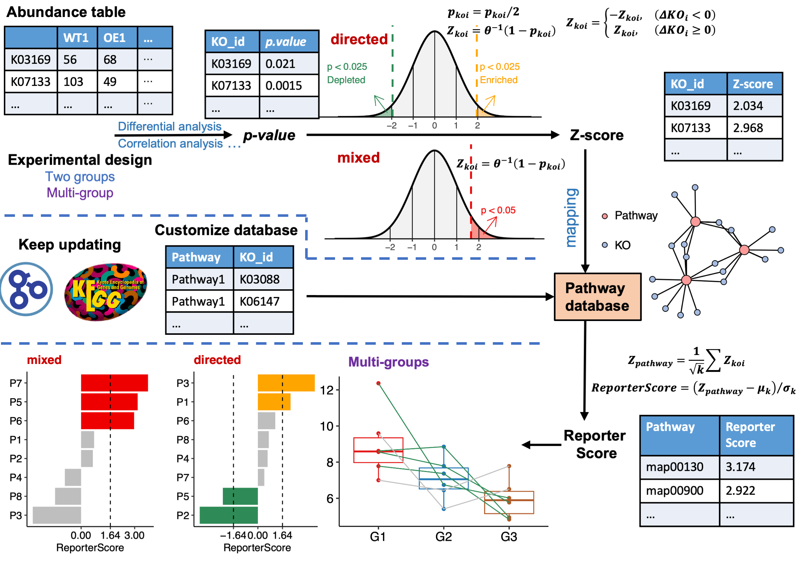
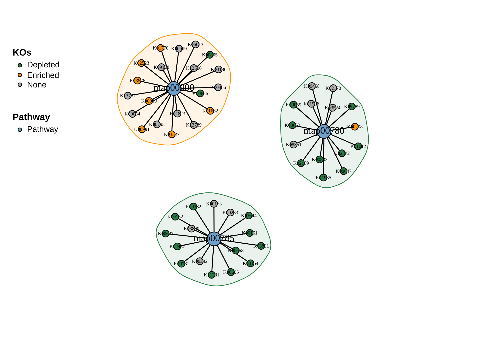

<!-- README.md is generated from README.Rmd. Please edit that file -->

# ReporterScore 

<!-- badges: start -->

[](https://github.com/Asa12138/ReporterScore/actions/workflows/R-CMD-check.yaml)
[](https://doi.org/10.1093/bib/bbae116)
[](https://asa-blog.netlify.app/)
[](https://cran.r-project.org/package=ReporterScore)
[](https://cran.r-project.org/package=ReporterScore)
[](https://cran.r-project.org/package=ReporterScore)
[](https://github.com/Asa12138/ReporterScore)
<!-- badges: end -->

Inspired by the classic ‘RSA’, we developed the improved ‘Generalized
Reporter Score-based Analysis (GRSA)’ method, implemented in the R
package ‘ReporterScore’, along with comprehensive visualization methods
and pathway databases.

‘GRSA’ is a threshold-free method that works well with all types of
biomedical features, such as genes, chemical compounds, and microbial
species. Importantly, the ‘GRSA’ supports **multi-group and longitudinal
experimental designs**, because of the included multi-group-compatible
statistical methods.



The HTML documentation of the latest version is available at [Github
page](https://asa12138.github.io/ReporterScore/).

## Citation

To cite ReporterScore in publications use:

C. Peng, Q. Chen, S. Tan, X. Shen, C. Jiang, Generalized Reporter
Score-based Enrichment Analysis for Omics Data. *Briefings in
Bioinformatics* (2024). <https://doi.org/10.1093/bib/bbae116>.

## Installation

You can install the released version of `ReporterScore` from
[CRAN](https://CRAN.R-project.org) with:

``` r
install.packages("ReporterScore")
```

You can install the development version of `ReporterScore` from
[GitHub](https://github.com/) with:

``` r
# install.packages("devtools")
devtools::install_github("Asa12138/pcutils")
devtools::install_github("Asa12138/ReporterScore")
```

## Usage

### 1. Inputdata (Feature abundance table and metadata)

- For transcriptomic, scRNA-seq, and related gene-based omics data of a
  specific species, a complete gene abundance table can be used.
- For metagenomic and metatranscriptomic data, which involve many
  different species, a KO abundance table can be used, generated using
  Blast, Diamond, or KEGG official mapper software to align the reads or
  contigs to the KEGG or the EggNOG database
- For metabolomic data, an annotated compound abundance table can be
  used, but the standardization of compound IDs (e.g., convert compound
  IDs to C numbers in the KEGG database) is required.

#### Format of abundance table:

⚠️**Importantly, the input abundance table should not be prefiltered to
retain the background information, as the ‘GRSA’ is a threshold-free
method.**

- The rownames are feature ids (e.g. “K00001” (KEGG K number) if
  feature=“ko”; “PEX11A” (gene symbol) if feature=“gene”; “C00024” (KEGG
  C number) if feature=“compound”).
- The colnames are samples.
- The abundance value can be read counts or normalized values (e.g.,
  TPM, FPKM, RPKM, or relative abundance, corresponds to suitable
  statistical test method).

An example code tailored for a KO abundance table is as follows:

``` r
data("KO_abundance_test")
head(KO_abundance[, 1:6])
#>                WT1         WT2         WT3         WT4         WT5         WT6
#> K03169 0.002653545 0.005096380 0.002033923 0.000722349 0.003468322 0.001483028
#> K07133 0.000308237 0.000280458 0.000596527 0.000859854 0.000308719 0.000878098
#> K03088 0.002147068 0.002030742 0.003797459 0.004161979 0.002076596 0.003091182
#> K03530 0.003788366 0.000239298 0.000445817 0.000557271 0.000222969 0.000529624
#> K06147 0.000785654 0.001213630 0.001312569 0.001662740 0.002387006 0.001725797
#> K05349 0.001816325 0.002813642 0.003274701 0.001089906 0.002371921 0.001795214
```

And you should also offer a experimental metadata:

#### Format of metadata table:

- The rownames are samples, columns are groups.
- The grouping variable can be categories (at least two categories, for
  differential abundance analysis).
- The grouping variable can also be multiple time points (for
  longitudinal analysis).
- The grouping variable can also be continuous (for correlation
  analysis).

``` r
head(metadata)
#>     Group Group2
#> WT1    WT     G3
#> WT2    WT     G3
#> WT3    WT     G3
#> WT4    WT     G3
#> WT5    WT     G3
#> WT6    WT     G1
```

⚠️**Importantly, the rownames of metadata and the colnames of feature
abundance table should be matching or partial matching!**

The `ReporterScore` will automatically match the samples based on the
rownames of metadata and the colnames of feature abundance table.

``` r
all(rownames(metadata) %in% colnames(KO_abundance))
## TRUE

intersect(rownames(metadata), colnames(KO_abundance))>0
## TRUE
```

### 2. Pathway databases

The `ReporterScore` package has built-in KEGG pathway, module, gene,
compound, and GO databases and also allows customized databases, making
it compatible with feature abundance tables from diverse omics data.

1.  `ReporterScore` has built-in KEGG pathway-KO and module-KO databases
    (2023-08 version) for KO abundance table. You can use
    `load_KOlist()` to have a look and use `update_KO_file()` to update
    these databases (by KEGG API) as using latest database is very
    important.

2.  `ReporterScore` has built-in KEGG pathway-compound and
    module-compound databases (2023-08 version) for compound abundance
    table. You can use `load_CPDlist()` to have a look and use
    `update_KO_file()` to update these databases (by KEGG API).

3.  `ReporterScore` has built-in pathway-ko, pathway-gene, and
    pathway-compound databases of human (hsa) and mouse (mmu) for
    ko/gene/compound abundance table. You can use
    `custom_modulelist_from_org()` to have a look. Use
    `update_org_pathway()` to update these databases and download other
    organism databases (by KEGG API).

4.  `ReporterScore` has built-in GO-gene database, You can use
    `load_GOlist()` to have a look and use `update_GOlist()` to update
    these databases (by KEGG API).

5.  You can just customize your own pathway databases (gene set of
    interest) by using `custom_modulelist()`.

``` r
# 1. KEGG pathway-KO and module-KO databases
KOlist <- load_KOlist()
head(KOlist$pathway)

# 2. KEGG pathway-compound and module-compound databases
CPDlist <- load_CPDlist()
head(CPDlist$pathway)

# 3. human (hsa) pathway-ko/gene/compound databases
hsa_pathway_gene <- custom_modulelist_from_org(
  org = "hsa",
  feature = c("ko", "gene", "compound")[2]
)
head(hsa_pathway_gene)

# 4. GO-gene database
GOlist <- load_GOlist()
head(GOlist$BP)

# 5. customize your own pathway databases
?custom_modulelist()
```

### 3. One step GRSA

Use function `GRSA` or `reporter_score` can get the reporter score
result by one step.

⚠️There are some important arguments for analysis:

- **mode**: “mixed” or “directed” (directed mode only for two groups
  differential analysis or multi-groups correlation analysis.), see
  details in `pvalue2zs`.
- **method**: the method of statistical test for calculating p-value.
  Default is `wilcox.test`:
  - `t.test` (parametric) and `wilcox.test` (non-parametric). Perform
    comparison between two groups of samples.
  - `anova` (parametric) and `kruskal.test` (non-parametric). Perform
    one-way ANOVA test or Kruskal-Wallis rank sum test comparing
    multiple groups.
  - “pearson”, “kendall”, or “spearman” (correlation), see `?cor`.
  - “none”: use “none” for `step by step enrichment`. You can calculate
    the p-value by other methods like “DESeq2”, “Edger”, “Limma”,
    “ALDEX”, “ANCOM” yourself.
- **type**: choose the built-in pathway database:
  - ‘pathway’ or ‘module’ for default KEGG database for **microbiome**.
  - ‘CC’, ‘MF’, ‘BP’, ‘ALL’ for default GO database for **homo
    sapiens**.
  - org in listed in <https://www.genome.jp/kegg/catalog/org_list.html>
    such as ‘hsa’ (if your kodf is come from a specific organism, you
    should specify type here)
- **modulelist**: customize database. A dataframe containing
  ‘id’,‘K_num’,‘KOs’,‘Description’ columns. Take the `KOlist` as
  example, use `custom_modulelist` to build a customize database.
- **feature**: one of “ko”, “gene”, “compound”.

**The first level will be set as the control group, you can change the
factor level to change your comparison.**

For example, we want to compare two groups ‘WT-OE’, and use the
“directed” mode as we just want know which pathways are enriched or
depleted in **OE group**:

#### KO-pathway

``` r
cat("Comparison: ", levels(factor(metadata$Group)), "\n")
#> Comparison:  WT OE

# for microbiome!!!
reporter_res <- GRSA(KO_abundance, "Group", metadata,
  mode = "directed",
  method = "wilcox.test", perm = 999,
  type = "pathway", feature = "ko"
)
#> ================================Use feature: ko=================================
#> ===============================Checking rownames================================
#> Some of your ko_stat are not KO id, check the format! (e.g. K00001)
#> 52.7% of your kos in the modulelist!
#> 30 samples are matched for next step.
#> ===========================Removing all-zero rows: 0============================
#> ===================================1.KO test====================================
#> =================================Checking group=================================
#> 30 samples are matched for next step.
#> ===========================Removing all-zero rows: 0============================
#> ==============================Calculating each KO===============================
#> ===========================Using method: wilcox.test============================
#> 1000 features done.
#> 2000 features done.
#> 3000 features done.
#> 4000 features done.
#> 
#> Compared groups: WT, OE
#> Total KO number: 4535
#> Compare method: wilcox.test
#> Time use: 1.179
#> =========================2.Transfer p.value to Z-score==========================
#> ==========================3.Calculating reporter score==========================
#> ==================================load KOlist===================================
#> ===================KOlist download time: 2023-08-14 16:00:52====================
#> If you want to update KOlist, use `update_KO_file()`
#> ============================Calculating each pathway============================
#> 100 pathways done.
#> 400 pathways done.
#> ID number: 481
#> Time use: 1.689
#> ====================================All done====================================
```

The result is a “reporter_score” object:

| elements     | description                                       |
|--------------|---------------------------------------------------|
| `kodf`       | your input KO_abundance table                     |
| `ko_stat`    | ko statistics result contains p.value and z_score |
| `reporter_s` | the reporter score in each pathway                |
| `modulelist` | default KOlist or customized modulelist dataframe |
| `group`      | The comparison groups in your data                |
| `metadata`   | sample information dataframe contains group       |

#### Gene-pathway

When you use the gene abundance table of a specific species
(e.g. human), remember to set the `feature` and `type`!!! Or give the
database through `modulelist`.

``` r
data("genedf")

# Method 1: Set the `feature` and `type`!
reporter_res_gene <- GRSA(genedf, "Group", metadata,
  mode = "directed",
  method = "wilcox.test", perm = 999,
  type = "hsa", feature = "gene"
)
#> ===============================Use feature: gene================================
#> ===============================Checking rownames================================
#> please make sure your input table rows are gene symbol!
#> 100% of your genes in the modulelist!
#> 30 samples are matched for next step.
#> ===========================Removing all-zero rows: 0============================
#> ===================================1.KO test====================================
#> =================================Checking group=================================
#> 30 samples are matched for next step.
#> ===========================Removing all-zero rows: 0============================
#> ==============================Calculating each KO===============================
#> ===========================Using method: wilcox.test============================
#> 1000 features done.
#> 
#> Compared groups: WT, OE
#> Total KO number: 1000
#> Compare method: wilcox.test
#> Time use: 0.224
#> =========================2.Transfer p.value to Z-score==========================
#> ==========================3.Calculating reporter score==========================
#> ================================load hsa pathway================================
#> =================hsa pathway download time: 2023-08-14 23:28:13=================
#> If you want to update hsa pathway, use `update_org_pathway('hsa')`
#> please assgin this custom modulelist to `reporter_score(modulelist=your_modulelist)` to do a custom enrichment.
#> You choose the feature: 'gene', make sure the rownames of your input table are right.
#> ============================Calculating each pathway============================
#> 100 pathways done.
#> 150 pathways done.
#> 200 pathways done.
#> 250 pathways done.
#> 300 pathways done.
#> ID number: 343
#> Time use: 1.558
#> ====================================All done====================================
```

``` r
# Method 2: Give the database through `modulelist`, same to Method 1.
hsa_pathway_gene <- custom_modulelist_from_org(
  org = "hsa",
  feature = "gene"
)

reporter_res_gene <- GRSA(genedf, "Group", metadata,
  mode = "directed",
  method = "wilcox.test", perm = 999,
  modulelist = hsa_pathway_gene
)
```

``` r
library(patchwork)
p1 <- plot_report_bar(reporter_res_gene, rs_threshold = 2)

# Use `modify_description` to remove the suffix of pathway description
reporter_res_gene2 <- modify_description(reporter_res_gene, pattern = " - Homo sapiens (human)")
p2 <- plot_report_bar(reporter_res_gene2, rs_threshold = 2)

# Use `ggplot_translator` to translate pathway description
p3 <- pcutils::ggplot_translator(p2)
#> Please set the font family to make the labels display well.
#>  see `how_to_set_font_for_plot()`.

p1 / p2 / p3
```


#### Compound-pathway

When you use the compound abundance table, remember to set the `feature`
and `type`!!! Or give the database through `modulelist`.

``` r
reporter_res_gene <- GRSA(chem_df, "Group", metadata,
  mode = "directed",
  method = "wilcox.test", perm = 999,
  type = "hsa", feature = "compound"
)
```

### 4. Visualization

After we get the reporter score result, we can visualize the result in
various ways.

When we focus on the whole result:

- Plot the most significantly enriched pathways:

You can set the `rs_threshold` to filter the pathways, the default
`rs_threshold` is 1.64, which is be considered as significant at the
0.05 level.

``` r
# View(reporter_res$reporter_s)
plot_report_bar(reporter_res, rs_threshold = c(-2.5, 2.5), facet_level = TRUE)
#> ==============================load Pathway_htable===============================
#> ===============Pathway_htable download time: 2024-01-12 00:52:39================
#> If you want to update Pathway_htable, use `update_htable(type='pathway')`
```


⚠️**In the directed mode, Enriched in one group means depleted in
another group.**

- Plot the most significantly enriched pathways (circle packing):

``` r
plot_report_circle_packing(reporter_res, rs_threshold = c(-2.5, 2.5))
#> ==============================load Pathway_htable===============================
#> ===============Pathway_htable download time: 2024-01-12 00:52:39================
#> If you want to update Pathway_htable, use `update_htable(type='pathway')`
#> Non-leaf weights ignored
#> Scale for fill is already present.
#> Adding another scale for fill, which will replace the existing scale.
```


When we focus on one pathway, e.g. “map00780”:

- Plot boxes and lines

``` r
plot_KOs_in_pathway(reporter_res, map_id = "map00780")
```


- Plot the distribution of Z-scores

``` r
plot_KOs_distribution(reporter_res, map_id = "map00780")
```


- Plot as a network:

``` r
plot_KOs_network(reporter_res,
  map_id = c("map00780", "map00785", "map00900"),
  main = "", mark_module = TRUE
)
```



- Plot the KOs abundance in a pathway:

``` r
plot_KOs_box(reporter_res, map_id = "map00780", only_sig = TRUE)
#> `geom_smooth()` using formula = 'y ~ x'
```


- Plot the KOs abundance in a pathway (heatmap):

``` r
plot_KOs_heatmap(reporter_res,
  map_id = "map00780", only_sig = TRUE,
  heatmap_param = list(cutree_rows = 2)
)
```


- Plot the KEGG pathway map:

``` r
plot_KEGG_map(reporter_res, map_id = "map00780", color_var = "Z_score")
```


### Example for multi-group or longitudinal

If our experimental design is more than two groups or longitudinal, we
can choose multi-groups comparison (or correlation):

``` r
cat("Comparison: ", levels(factor(metadata$Group2)))
#> Comparison:  G1 G2 G3

reporter_res2 <- GRSA(KO_abundance, "Group2", metadata,
  mode = "directed",
  method = "spearman", perm = 999
)
#> ================================Use feature: ko=================================
#> ===============================Checking rownames================================
#> Some of your ko_stat are not KO id, check the format! (e.g. K00001)
#> 52.7% of your kos in the modulelist!
#> 30 samples are matched for next step.
#> ===========================Removing all-zero rows: 0============================
#> ===================================1.KO test====================================
#> =================================Checking group=================================
#> 30 samples are matched for next step.
#> ===========================Removing all-zero rows: 0============================
#> ==============================Calculating each KO===============================
#> =============================Using method: spearman=============================
#> Using correlation analysis: spearman, the groups will be transform to numeric, note the factor feature of group.
#> 1000 features done.
#> 2000 features done.
#> 3000 features done.
#> 4000 features done.
#> 
#> Compared groups: G1, G2, G3
#> Total KO number: 4535
#> Compare method: spearman
#> Time use: 0.549
#> =========================2.Transfer p.value to Z-score==========================
#> ==========================3.Calculating reporter score==========================
#> ==================================load KOlist===================================
#> ===================KOlist download time: 2023-08-14 16:00:52====================
#> If you want to update KOlist, use `update_KO_file()`
#> ============================Calculating each pathway============================
#> 100 pathways done.
#> 400 pathways done.
#> ID number: 481
#> Time use: 1.643
#> ====================================All done====================================

plot_KOs_in_pathway(reporter_res2, map_id = "map02060") + scale_y_log10()
```


### Example for specified pattern

For example, groups “G1”, “G2”, and “G3” can be set as 1, 10, and 100 if
an exponentially increasing trend is expected.

We use 1,5,1 to found pathways with the down-up-down pattern

``` r
reporter_res3 <- GRSA(KO_abundance, "Group2", metadata,
  mode = "directed", perm = 999,
  method = "pearson", pattern = c("G1" = 1, "G2" = 5, "G3" = 1)
)
plot_report_bar(reporter_res3, rs_threshold = 3, show_ID = TRUE)
```


``` r
plot_KOs_in_pathway(reporter_res3, map_id = "map00860")
```


To explore potential patterns within the data, clustering methods, such
as C-means clustering, can be used.

``` r
rsa_cm_res <- RSA_by_cm(KO_abundance, "Group2", metadata,
  method = "pearson",
  k_num = 3, perm = 999
)
# show the patterns
plot_c_means(rsa_cm_res, filter_membership = 0.7)
```


``` r

plot_report_bar(rsa_cm_res, rs_threshold = 2.5, y_text_size = 10)
```


## Details

### Step by step

The one step function `reporter_score` consists of three parts：

``` r
data("KO_abundance_test")
ko_pvalue <- ko.test(KO_abundance, "Group", metadata, method = "wilcox.test")
ko_stat <- pvalue2zs(ko_pvalue, mode = "directed")
reporter_s1 <- get_reporter_score(ko_stat, perm = 499)
```

1.  `ko.test`: this function help to calculate *p-value* for
    KO_abundance by various built-in methods such as differential
    analysis (`t.test`, `wilcox.test`, `kruskal.test`, `anova`) or
    correlation analysis (`pearson`, `spearman`, `kendall`). **You can
    also calculate this *p-value* for KO_abundance by other methods**
    like “DESeq2”, “Edger”, “Limma”, “ALDEX”, “ANCOM” and do a p.adjust
    yourself, then skip `ko.test` step go to step2…
2.  `pvalue2zs`: this function transfers p-value of KOs to Z-score
    (select mode: “mixed” or “directed”).
3.  `get_reporter_score` this function calculate reporter score of each
    pathways in a specific database. You can use a custom database here.

Take the “Limma” as an example:

``` r
# 1-1. Calculate p-value by Limma
ko_pvalue <- ko.test(KO_abundance, "Group", metadata, method = "none")

ko_Limma_p <- pctax::diff_da(KO_abundance, group_df = metadata["Group"], method = "limma")

# 1-2. Replace the p-value in ko_pvalue, remember to match the KO_ids
ko_pvalue$`p.value` <- ko_Limma_p[match(ko_pvalue$KO_id, ko_Limma_p$tax), "pvalue"]

# 2. Use `pvalue2zs` to get Z-score
ko_stat <- pvalue2zs(ko_pvalue, mode = "directed")

# 3. Use `get_reporter_score` to get reporter score
reporter_s1 <- get_reporter_score(ko_stat, perm = 499)

# 4. Combine the result
reporter_res1 <- combine_rs_res(KO_abundance, "Group", metadata, ko_stat, reporter_s1)

# Then the reporter_res1 can be used for visualization
```

### Other commonly used enrichment methods

| Category | Method                                                            | Tools                                             | Notes                                                                                                                                                        |
|:---------|:------------------------------------------------------------------|:--------------------------------------------------|:-------------------------------------------------------------------------------------------------------------------------------------------------------------|
| ORA      | Hypergeometric test / Fisher’s exact test                         | DAVID (website) , clusterProfiler (R package)     | The most common methods used in enrichment analysis. Selecting a list of genes is required.                                                                  |
| FCS      | Gene set enrichment analysis (GSEA)                               | GSEA (website)                                    | GSEA creatively uses gene ranking, rather than selecting a list of genes, to identify statistically significant and concordant differences across gene sets. |
| FCS      | Generalized reporter score-based analysis (GRSA/RSA)              | ReporterScore (R package developed in this study) | Find significant metabolites (first report), pathways, and taxonomy based on the p-values for multi-omics data.                                              |
| FCS      | Significance Analysis of Function and Expression (SAFE)           | safe (R package)                                  | SAFE assesses the significance of gene categories by calculating both local and global statistics from gene expression data.                                 |
| FCS      | Gene Set Analysis (GSA)                                           | GSA (R Package)                                   | GSA was proposed as an improvement of GSEA, using the “maxmean” statistic instead of the weighted sign KS statistic.                                         |
| FCS      | Pathway Analysis with Down-weighting of Overlapping Genes (PADOG) | PADOG (R package)                                 | PADOGA assumes that genes associated with fewer pathways have more significant effects than genes associated with more pathways.                             |
| FCS      | Gene Set Variation Analysis (GSVA)                                | GSVA (R package)                                  | A nonparametric, unsupervised method that transforms gene expression data into gene set scores for downstream differential pathway activity analysis.        |
| PT       | Topology-based pathway enrichment analysis (TPEA)                 | TPEA (R package)                                  | Integrate topological properties and global upstream/downstream positions of genes in pathways.                                                              |

Commonly used enrichment methods for omics data.

`ReporterScore` also provides other enrichment methods like
`KO_fisher`(fisher.test), `KO_enrich`(fisher.test, from
`clusterProfiler`), `KO_gsea` (GSEA, from `clusterProfiler`).

The input data is from `reporter_score`, and also supports custom
databases, so you can easily compare the results of various enrichment
methods and conduct a comprehensive analysis:

``` r
# View(reporter_res2$reporter_s)
# reporter_score
filter(reporter_res$reporter_s, abs(ReporterScore) > 1.64, p.adjust < 0.05) %>% pull(ID) -> RS
# fisher
fisher_res <- KO_fisher(reporter_res)
filter(fisher_res, p.adjust < 0.05) %>% pull(ID) -> Fisher
# enricher
enrich_res <- KO_enrich(reporter_res)
filter(enrich_res, p.adjust < 0.05) %>% pull(ID) -> clusterProfiler
# GESA
set.seed(1234)
gsea_res <- KO_gsea(reporter_res, weight = "Z_score")
#> Warning in preparePathwaysAndStats(pathways, stats, minSize, maxSize, gseaParam, : There are ties in the preranked stats (57.15% of the list).
#> The order of those tied genes will be arbitrary, which may produce unexpected results.
#> Warning in fgseaMultilevel(pathways = pathways, stats = stats, minSize =
#> minSize, : For some pathways, in reality P-values are less than 1e-10. You can
#> set the `eps` argument to zero for better estimation.
filter(data.frame(gsea_res), p.adjust < 0.05) %>% pull(ID) -> GSEA

venn_res <- list(GRSA = RS, Fisher = Fisher, CP = clusterProfiler, GSEA = GSEA)
library(pcutils)
venn(venn_res, "network")
```


## Other features

### uplevel the KOs

[KEGG BRITE](https://www.genome.jp/kegg/brite.html) is a collection of
hierarchical classification systems capturing functional hierarchies of
various biological objects, especially those represented as KEGG
objects.

We collected k00001 KEGG Orthology (KO) table so that you can summaries
each levels abundance. Use `load_KO_htable` to get KO_htable and use
`update_KO_htable` to update. Use `up_level_KO` can upgrade to specific
level in one of “pathway”, “module”, “level1”, “level2”, “level3”,
“module1”, “module2”, “module3”.

``` r
KO_htable <- load_KO_htable()
#> =================================load KO_htable=================================
#> ==================KO_htable download time: 2024-01-12 00:49:03==================
#> If you want to update KO_htable, use `update_htable(type='ko')`
head(KO_htable)
#>   level1_name             level2_name level3_id                  level3_name
#> 1  Metabolism Carbohydrate metabolism  map00010 Glycolysis / Gluconeogenesis
#> 2  Metabolism Carbohydrate metabolism  map00010 Glycolysis / Gluconeogenesis
#> 3  Metabolism Carbohydrate metabolism  map00010 Glycolysis / Gluconeogenesis
#> 4  Metabolism Carbohydrate metabolism  map00010 Glycolysis / Gluconeogenesis
#> 5  Metabolism Carbohydrate metabolism  map00010 Glycolysis / Gluconeogenesis
#> 6  Metabolism Carbohydrate metabolism  map00010 Glycolysis / Gluconeogenesis
#>    KO_id                                                    KO_name
#> 1 K00844                                HK; hexokinase [EC:2.7.1.1]
#> 2 K12407                              GCK; glucokinase [EC:2.7.1.2]
#> 3 K00845                              glk; glucokinase [EC:2.7.1.2]
#> 4 K25026                              glk; glucokinase [EC:2.7.1.2]
#> 5 K01810       GPI, pgi; glucose-6-phosphate isomerase [EC:5.3.1.9]
#> 6 K06859 pgi1; glucose-6-phosphate isomerase, archaeal [EC:5.3.1.9]
plot_htable(type = "ko")
#> =================================load KO_htable=================================
#> ==================KO_htable download time: 2024-01-12 00:49:03==================
#> If you want to update KO_htable, use `update_htable(type='ko')`
#> Warning: Vectorized input to `element_text()` is not officially supported.
#> ℹ Results may be unexpected or may change in future versions of ggplot2.
```


``` r
KO_level1 <- up_level_KO(KO_abundance, level = "level1", show_name = TRUE)
#> =================================load KO_htable=================================
#> ==================KO_htable download time: 2024-01-12 00:49:03==================
#> If you want to update KO_htable, use `update_htable(type='ko')`
pcutils::stackplot(KO_level1[-which(rownames(KO_level1) == "Unknown"), ]) +
  ggsci::scale_fill_d3() +
  theme(axis.text.x = element_text(angle = 90, hjust = 1, vjust = 0.5))
```


### CARD for ARGs

For convenience, I also included the CARD database from
<https://card.mcmaster.ca/download/0/broadstreet-v3.2.8.tar.bz2>.

``` r
CARDinfo <- load_CARDinfo()
#> =================================load CARDinfo==================================
#> ==================CARDinfo download time: 2024-01-12 01:12:11===================
#> If you want to update CARDinfo, use `update_GOlist()`
head(CARDinfo$ARO_index)
#>         ARO Accession CVTERM ID Model Sequence ID Model ID
#> 3005099   ARO:3005099     43314              6143     3831
#> 3002523   ARO:3002523     38923              8144     1781
#> 3002524   ARO:3002524     38924                85      746
#> 3002525   ARO:3002525     38925              4719     1246
#> 3002526   ARO:3002526     38926               228     1415
#> 3002527   ARO:3002527     38927              5510     2832
#>                                                     Model Name
#> 3005099 23S rRNA (adenine(2058)-N(6))-methyltransferase Erm(A)
#> 3002523                                             AAC(2')-Ia
#> 3002524                                             AAC(2')-Ib
#> 3002525                                             AAC(2')-Ic
#> 3002526                                             AAC(2')-Id
#> 3002527                                             AAC(2')-Ie
#>                                                       ARO Name
#> 3005099 23S rRNA (adenine(2058)-N(6))-methyltransferase Erm(A)
#> 3002523                                             AAC(2')-Ia
#> 3002524                                             AAC(2')-Ib
#> 3002525                                             AAC(2')-Ic
#> 3002526                                             AAC(2')-Id
#> 3002527                                             AAC(2')-Ie
#>         Protein Accession DNA Accession                         AMR Gene Family
#> 3005099        AAB60941.1    AF002716.1 Erm 23S ribosomal RNA methyltransferase
#> 3002523        AAA03550.1      L06156.2                                 AAC(2')
#> 3002524        AAC44793.1      U41471.1                                 AAC(2')
#> 3002525        CCP42991.1    AL123456.3                                 AAC(2')
#> 3002526        AAB41701.1      U72743.1                                 AAC(2')
#> 3002527        CAC32082.1    AL583926.1                                 AAC(2')
#>                                                                   Drug Class
#> 3005099 lincosamide antibiotic;macrolide antibiotic;streptogramin antibiotic
#> 3002523                                            aminoglycoside antibiotic
#> 3002524                                            aminoglycoside antibiotic
#> 3002525                                            aminoglycoside antibiotic
#> 3002526                                            aminoglycoside antibiotic
#> 3002527                                            aminoglycoside antibiotic
#>                 Resistance Mechanism CARD Short Name
#> 3005099 antibiotic target alteration  Spyo_ErmA_MLSb
#> 3002523      antibiotic inactivation      AAC(2')-Ia
#> 3002524      antibiotic inactivation      AAC(2')-Ib
#> 3002525      antibiotic inactivation      AAC(2')-Ic
#> 3002526      antibiotic inactivation      AAC(2')-Id
#> 3002527      antibiotic inactivation      AAC(2')-Ie
```

# Reference

1.  Patil, K. R. & Nielsen, J. Uncovering transcriptional regulation of
    metabolism by using metabolic network topology. Proc Natl Acad Sci U
    S A 102, 2685–2689 (2005).

2.  L. Liu, R. Zhu, D. Wu, Misuse of reporter score in microbial
    enrichment analysis. iMeta. 2, e95 (2023).

3.  <https://github.com/wangpeng407/ReporterScore>
