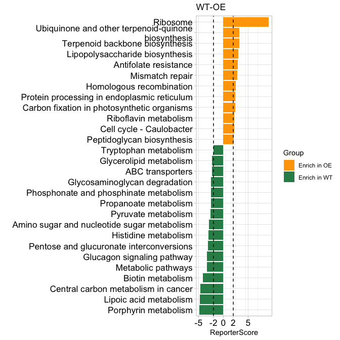
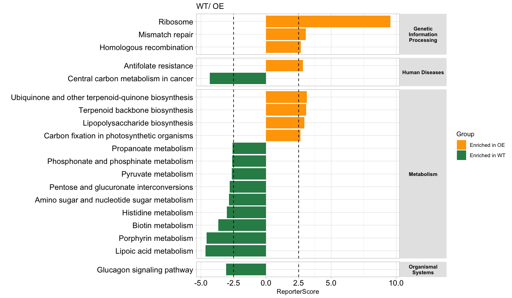
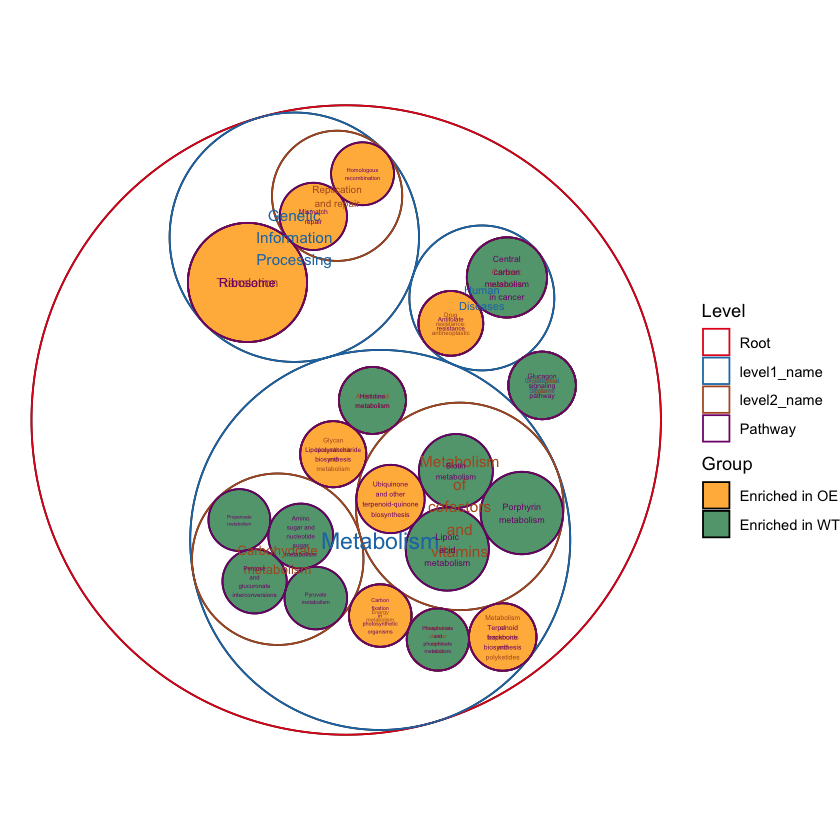
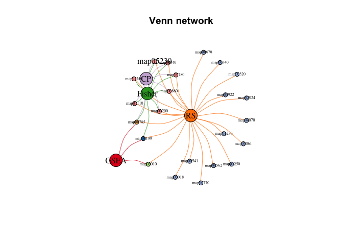

# ReporterScore

Reporter Score-based Microbial Enrichment Analysis

# Citation

To cite ReporterScore in publications use:

  Chen Peng, Chao Jiang. ReporterScore: an R package for Reporter Score-based Microbial Enrichment Analysis. R package (2023),
  <https://github.com/Asa12138/ReporterScore>

## Install


```r
if(!require("devtools"))install.packages("devtools")
devtools::install_github('Asa12138/pcutils',dependencies=T)
devtools::install_github('Asa12138/ReporterScore',dependencies=T)
library(ReporterScore)
```

## Usage

### 1. Inputdata (KO abundance table and metadata)

Typically, we can use [KEGG database](https://www.kegg.jp/kegg/) to annotate our microbiome sequencing data, especially environmental microbiome because KEGG is more comprehensive.

Specific methods include using blast to align the KEGG sequence database, using KEGG official mapper software, and using the [EggNOG database](http://eggnog5.embl.de/#/app/home) and converting the results into KEGG annotations.

So that we can get a KO abundance table (rows are KOs, columns are samples) for our enrichment analysis:


```r
data("KO_abundance_test")
head(KO_abundance[,1:6])
```

```
##                WT1         WT2         WT3         WT4         WT5         WT6
## K03169 0.002653545 0.005096380 0.002033923 0.000722349 0.003468322 0.001483028
## K07133 0.000308237 0.000280458 0.000596527 0.000859854 0.000308719 0.000878098
## K03088 0.002147068 0.002030742 0.003797459 0.004161979 0.002076596 0.003091182
## K03530 0.003788366 0.000239298 0.000445817 0.000557271 0.000222969 0.000529624
## K06147 0.000785654 0.001213630 0.001312569 0.001662740 0.002387006 0.001725797
## K05349 0.001816325 0.002813642 0.003274701 0.001089906 0.002371921 0.001795214
```

And you should also offer a experimental metadata (rows are samples, columns are groups).


```r
head(metadata)
```

```
##     Group Group2
## WT1    WT     G3
## WT2    WT     G3
## WT3    WT     G3
## WT4    WT     G3
## WT5    WT     G3
## WT6    WT     G1
```

### 2. Pathway database

`ReporterScore` has built-in KEGG pathway and module databases (2023-08 version) for KO abundance table.

You can use `load_KOlist()` to have a look and use `update_KO_file()` to update these databases (by KEGG API) as using latest database is very important.

Or you can just customize your own pathway databases (gene set of interest) by using `custom_modulelist()`.


```r
load_KOlist()
head(KOlist$pathway)
```

### 3. One step enrichment

Use function `reporter_score` can get the reporter score result by one step.

there are some important arguments for analysis:

-   **mode**: "mixed" or "directed" (only for two groups differential analysis or multi-groups correlation analysis.), see details in `pvalue2zs`.
-   **method**: the type of test. Default is `wilcox.test`:
    -   `t.test` (parametric) and `wilcox.test` (non-parametric). Perform comparison between two groups of samples. If the grouping variable contains more than two levels, then a pairwise comparison is performed.
    -   `anova` (parametric) and `kruskal.test` (non-parametric). Perform one-way ANOVA test comparing multiple groups.
    -   "pearson", "kendall", or "spearman" (correlation), see `cor`.
-   **p.adjust.method**: p.adjust.method used for test result, see `p.adjust`.
-   **type**/**modulelist**: choose the pathway database, "pathway" or "module" for default database, or use a customized modulelist.

The first level will be set as the **control group**, you can change the factor level to change your comparison.

For example, we want to compare two groups 'WT-OE', and use the "directed" mode as we just want know which pathways are enriched or depleted in **OE group**:


```r
cat("Comparison: ",levels(factor(metadata$Group)))
## Comparison:  WT OE

reporter_score_res=reporter_score(KO_abundance,"Group",metadata,mode="directed")
## ===================================1.KO test====================================
## ===============================Checking rownames================================
## Some of your kodf are not KO id, check the format! (e.g. K00001)
## =================================Checking group=================================
## 30 samples are matched for next step.
## ===========================Removing all-zero rows: 0============================
## ==============================Calculating each KO===============================
## ===========================Using method: wilcox.test============================
## 1000 done.
## 2000 done.
## 3000 done.
## 4000 done.
## Compared groups: WT, OE
## Total KO number: 4535
## Compare method: wilcox.test
## Time use: 1.142
## =========================2.Transfer p.value to z-score==========================
## ==========================3.Calculating reporter score==========================
## =================================Checking file==================================
## Some of your ko_stat are not KO id, check the format! (e.g. K00001)!
## ==================================load KOlist===================================
## ===================KOlist download time: 2023-07-28 14:07:08====================
## If you want to update KOlist, use `update_KO_file()`
## ============================Calculating each pathway============================
## 100 done.
## 400 done.
## ID number: 481
## Time use: 1.583
## ====================================All done====================================
## ==================================load KOlist===================================
## ===================KOlist download time: 2023-07-28 14:07:08====================
## If you want to update KOlist, use `update_KO_file()`
```

The result is a "reporter_score" object:

|  elements    |  description                                      |
|--------------|---------------------------------------------------|
| `kodf`       | your input KO_abundance table                     |
| `ko_pvalue`  | ko statistics result contains p.value             |
| `ko_stat`    | ko statistics result contains p.value and z_score |
| `reporter_s` | the reporter score in each pathway                |
| `modulelist` | default KOlist or customized modulelist dataframe |
| `group`      | The comparison groups in your data                |
| `metadata`   | sample information dataframe contains group       |

### 4. Visualization

Plot the most significantly enriched pathways:


```r
#View(reporter_score_res$reporter_s)
plot_report(reporter_score_res,rs_threshold = c(-2,2))
```

<!-- -->

When we focus on one pathway, e.g. "map00780":


```r
plot_KOs_in_pathway(reporter_score_res,map_id = "map00780")
```

<!-- -->

Or display as a network:


```r
plot_KOs_network(reporter_score_res,map_id = "map00780",main="")
```

```
## Loading required namespace: MetaNet
```

```
## Loading required namespace: tidyr
```

<!-- -->

And we also look at the KOs abundance in a pathway:


```r
plot_KOs_box(reporter_score_res,map_id = "map00780",only_sig = TRUE)
```

```
## Loading required namespace: ggpubr
```

```
## `geom_smooth()` using formula = 'y ~ x'
```

<!-- -->

Or display as a heatmap:


```r
plot_KOs_heatmap(reporter_score_res,map_id = "map00780",only_sig = TRUE,heatmap_param = list(cutree_rows=2))
```

```
## Loading required namespace: pheatmap
```

<!-- -->

### example for "mixed"

If our experimental design is more than two groups, we can choose multi-groups comparison and "mixed" mode:


```r
cat("Comparison: ",levels(factor(metadata$Group2)))
## Comparison:  G1 G2 G3

reporter_score_res2=reporter_score(KO_abundance,"Group2",metadata,mode="mixed",
      method = "kruskal.test",p.adjust.method1 = "none")
## ===================================1.KO test====================================
## ===============================Checking rownames================================
## Some of your kodf are not KO id, check the format! (e.g. K00001)
## =================================Checking group=================================
## 30 samples are matched for next step.
## ===========================Removing all-zero rows: 0============================
## ==============================Calculating each KO===============================
## ===========================Using method: kruskal.test===========================
## 1000 done.
## 2000 done.
## 3000 done.
## 4000 done.
## Compared groups: G1, G2, G3
## Total KO number: 4535
## Compare method: kruskal.test
## Time use: 1.195
## =========================2.Transfer p.value to z-score==========================
## ==========================3.Calculating reporter score==========================
## =================================Checking file==================================
## Some of your ko_stat are not KO id, check the format! (e.g. K00001)!
## ==================================load KOlist===================================
## ===================KOlist download time: 2023-07-28 14:07:08====================
## If you want to update KOlist, use `update_KO_file()`
## ============================Calculating each pathway============================
## 100 done.
## 400 done.
## ID number: 481
## Time use: 1.597
## ====================================All done====================================
## ==================================load KOlist===================================
## ===================KOlist download time: 2023-07-28 14:07:08====================
## If you want to update KOlist, use `update_KO_file()`

plot_KOs_in_pathway(reporter_score_res2,map_id = "map00541")
```

<!-- -->

## Details

### Step by step

The one step function `reporter_score` consists of three parts：

1.  `ko.test`: this function help to calculate *p-value* for KO_abundance by various built-in methods such as differential analysis (t.test, wilcox.test, kruskal.test, anova) or correlation analysis (pearson, spearman, kendall). **You can also calculate this *p-value* for KO_abundance by other methods** like "DESeq2", "Edger", "Limma", "ALDEX", "ANCOM" and do a p.adjust yourself, then skip `ko.test` step go to step2...
2.  `pvalue2zs`: this function transfers p-value of KOs to Z-score (select mode: "mixed" or "directed").
3.  `get_reporter_score` this function calculate reporter score of each pathways in a specific database. You can use a custom database here.

So that you can get reporterscore step by step.

### Other enrichment methods

`ReporterScore` also provides other enrichment methods like `KO_fisher`(fisher.test), `KO_enrich`(fisher.test, from `clusterProfiler`), `KO_gsea` (GSEA, from `clusterProfiler`), The inputdata is from `reporter_score`, and also supports custom databases, so you can easily compare the results of various enrichment methods and conduct a comprehensive analysis:


```r
data("KO_abundance_test")
reporter_score_res2=reporter_score(KO_abundance,"Group",metadata,mode="mixed")
#View(reporter_score_res2$reporter_s)
#reporter_score
reporter_score_res2$reporter_s$p.adjust=p.adjust(reporter_score_res2$reporter_s$p.value,"BH")
filter(reporter_score_res2$reporter_s,(ReporterScore)>1.64,p.adjust<0.05)%>%pull(ID)->RS
#fisher
ko_pvalue=reporter_score_res2$ko_pvalue
fisher_res=KO_fisher(ko_pvalue)
filter(fisher_res,p.adjust<0.05)%>%pull(ID)->Fisher
#enricher
enrich_res=KO_enrich(ko_pvalue)
filter(enrich_res,p.adjust<0.05)%>%pull(ID)->clusterProfiler
#GESA
set.seed(1234)
gsea_res=KO_gsea(ko_pvalue)
filter(gsea_res@result,p.adjust<0.05)%>%pull(ID)->GSEA

venn_res=list(RS=RS,Fisher=Fisher,CP=clusterProfiler,GSEA=GSEA)
library(pcutils)
venn(venn_res)
```

<!-- -->

```r
venn(venn_res,"network",vertex.label.cex=c(rep(1,4),rep(0.5,22)))
```

<!-- -->

### KO levels

[KEGG BRITE](https://www.genome.jp/kegg/brite.html) is a collection of hierarchical classification systems capturing functional hierarchies of various biological objects, especially those represented as KEGG objects.

We collected k00001 KEGG Orthology (KO) table so that you can summaries each levels abundance. Use `load_KO_htable` to get KO_htable and use `update_KO_htable` to update. Use `up_level_KO` can upgrade to specific level in one of "pathway", "module", "level1", "level2", "level3", "module1", "module2", "module3".


```r
load_KO_htable()
```

```
## =================================load KO_htable=================================
```

```
## ==================KO_htable download time: 2023-07-31 11:21:54==================
```

```
## If you want to update KO_htable, use `update_KO_htable()`
```

```r
head(KO_htable)
```

```
## # A tibble: 6 × 8
##   level1_id level1_name level2_id level2_name        level3_id level3_name KO_id
##   <chr>     <chr>       <chr>     <chr>              <chr>     <chr>       <chr>
## 1 A09100    Metabolism  B09101    Carbohydrate meta… map00010  Glycolysis… K008…
## 2 A09100    Metabolism  B09101    Carbohydrate meta… map00010  Glycolysis… K124…
## 3 A09100    Metabolism  B09101    Carbohydrate meta… map00010  Glycolysis… K008…
## 4 A09100    Metabolism  B09101    Carbohydrate meta… map00010  Glycolysis… K250…
## 5 A09100    Metabolism  B09101    Carbohydrate meta… map00010  Glycolysis… K018…
## 6 A09100    Metabolism  B09101    Carbohydrate meta… map00010  Glycolysis… K068…
## # ℹ 1 more variable: KO_name <chr>
```

```r
plot_KO_htable()
```

```
## =================================load KO_htable=================================
```

```
## ==================KO_htable download time: 2023-07-31 11:21:54==================
```

```
## If you want to update KO_htable, use `update_KO_htable()`
```

<!-- -->

```r
KO_level1=up_level_KO(KO_abundance,level = "level1",show_name = TRUE)
## =================================load KO_htable=================================
## ==================KO_htable download time: 2023-07-31 11:21:54==================
## If you want to update KO_htable, use `update_KO_htable()`
pcutils::stackplot(KO_level1[-which(rownames(KO_level1)=="Unknown"),])
```

<!-- -->


# Reference

1.  Patil, K. R.
    & Nielsen, J. Uncovering transcriptional regulation of metabolism by using metabolic network topology.
    Proc Natl Acad Sci U S A 102, 2685--2689 (2005).

2.  Liu, L., Zhu, R.
    & Wu, D. Misuse of reporter score in microbial enrichment analysis.
    iMeta n/a, e95.

3.  <https://github.com/wangpeng407/ReporterScore>
