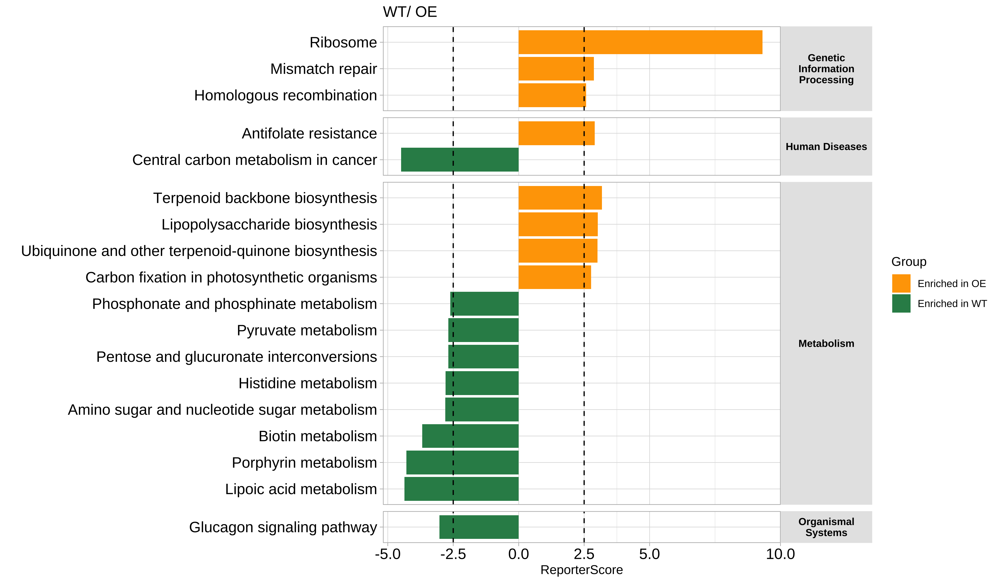
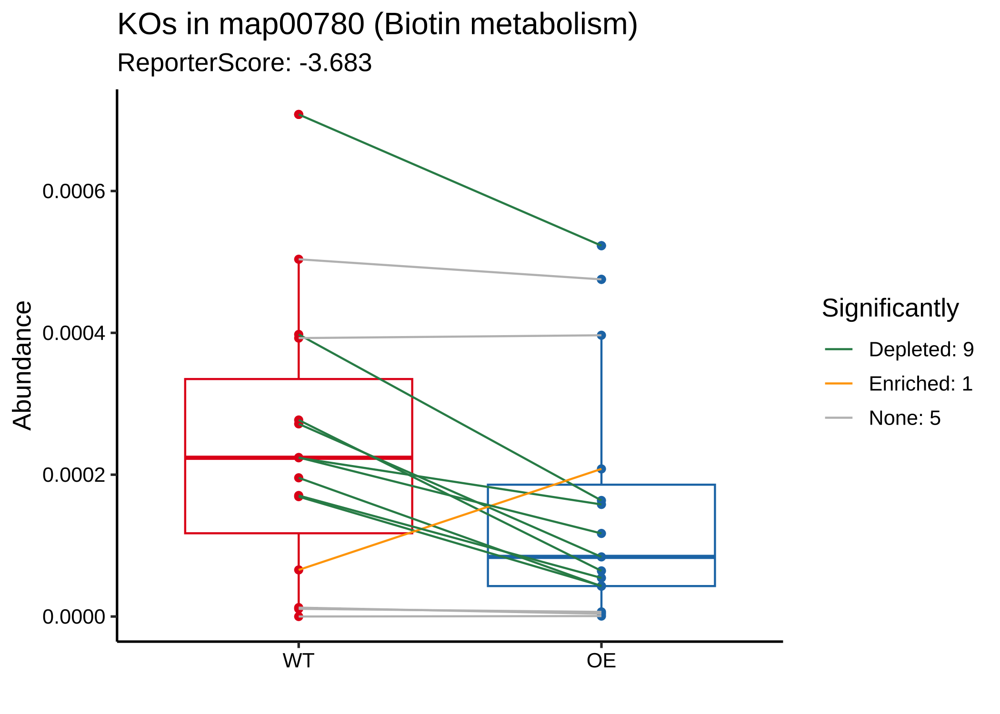
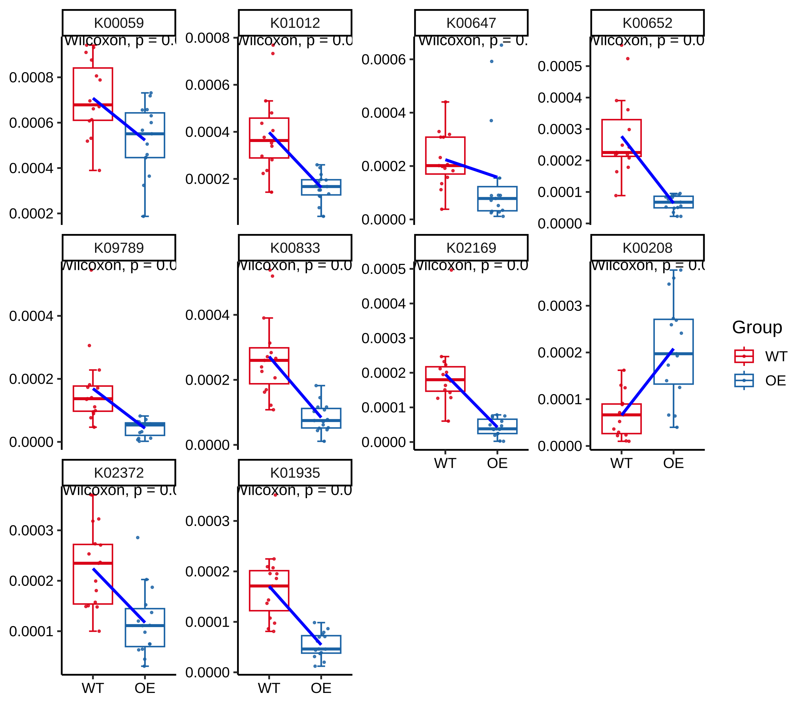
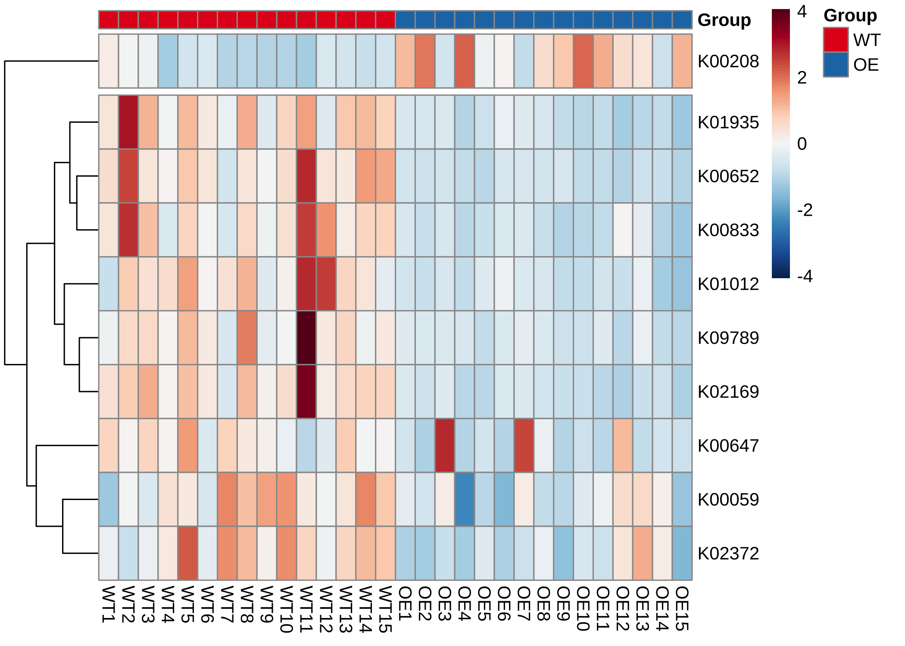

<!-- README.md is generated from README.Rmd. Please edit that file -->

**其他语言版本: [English](README.md), [中文](README_zh_CN.md).**

# ReporterScore 

<!-- badges: start -->

[](https://github.com/Asa12138/ReporterScore/actions/workflows/R-CMD-check.yaml)
[](https://doi.org/10.1093/bib/bbae116)
[](https://asa-blog.netlify.app/)
[](https://cran.r-project.org/package=ReporterScore)
[](https://cran.r-project.org/package=ReporterScore)
[](https://cran.r-project.org/package=ReporterScore)
[](https://github.com/Asa12138/ReporterScore)
<!-- badges: end -->

受经典RSA启发，我们开发了改进的广义报告评分分析（GRSA）方法，并在R包ReporterScore中实现了该方法，还集成了全面的可视化方法和通路数据库。 

GRSA是一种无阈值方法，适用于所有类型的生物医学特征，如基因、化合物和微生物物种。GRSA可在mixed模式（经典RSA）和directed模式（增强RSA）下工作。directed模式使用报告评分的符号区分上调或下调的通路，所以更直观。

重要的是，GRSA支持多组和纵向实验设计，因为它包含了与多组和纵向实验设计兼容的统计方法。 ReporterScore包还支持自定义的分层和关系数据库，为高级用户提供额外的灵活性。


最新版本的HTML文档可在[Github 主页](https://asa12138.github.io/ReporterScore/)找到.

## 引用

在出版物中引用ReporterScore：

C. Peng, Q. Chen, S. Tan, X. Shen, C. Jiang, Generalized Reporter
Score-based Enrichment Analysis for Omics Data. *Briefings in
Bioinformatics* (2024). <https://doi.org/10.1093/bib/bbae116>.

## 安装

您可以从[CRAN](https://CRAN.R-project.org)安装已发布版本的`ReporterScore`：

``` r
install.packages("ReporterScore")
```

也可以从[GitHub](https://github.com/)安装开发版本 `ReporterScore`：

``` r
# install.packages("devtools")
devtools::install_github("Asa12138/pcutils")
devtools::install_github("Asa12138/ReporterScore")
```

## 使用

### 1. 输入数据（特征丰度表和元数据）

- 对于特定物种的转录组、单细胞RNA-seq和相关基因组学数据，可以使用完整的基因丰度表。
- 对于涉及多种不同物种的宏基因组和宏转录组数据，可以使用KO丰度表，使用Blast、Diamond或KEGG官方映射软件来将reads或contigs对齐到KEGG或EggNOG数据库。
- 对于代谢组数据，可以使用已注释的化合物丰度表，但需要进行化合物ID的标准化（例如，将化合物ID转换为KEGG数据库中的C编号）。

#### 丰度表的格式：

⚠️ **重要提示：输入的丰度表不应进行预过滤（保留背景信息），因为‘GRSA’是一种无阈值的方法。**

- 行名为特征ID（例如，“K00001”（KEGG K号）如果特征为“ko”；“PEX11A”（基因符号）如果特征为“gene”；“C00024”（KEGG C号）如果特征为“compound”）。
- 列名为样本。
- 丰度值可以是读数count或标准化值（例如TPM、FPKM、RPKM或相对丰度），对应适当的统计检验方法。

适用于KO丰度表的示例代码如下：

``` r
data("KO_abundance_test")
head(KO_abundance[, 1:6])
#>                WT1         WT2         WT3         WT4         WT5         WT6
#> K03169 0.002653545 0.005096380 0.002033923 0.000722349 0.003468322 0.001483028
#> K07133 0.000308237 0.000280458 0.000596527 0.000859854 0.000308719 0.000878098
#> K03088 0.002147068 0.002030742 0.003797459 0.004161979 0.002076596 0.003091182
#> K03530 0.003788366 0.000239298 0.000445817 0.000557271 0.000222969 0.000529624
#> K06147 0.000785654 0.001213630 0.001312569 0.001662740 0.002387006 0.001725797
#> K05349 0.001816325 0.002813642 0.003274701 0.001089906 0.002371921 0.001795214
```

你还应该提供一个实验设计元数据：

#### 元数据表的格式：

- 行名为样本，列名为分组。
- 分组变量可以是类别（至少包含两个类别，用于差异丰度分析）。
- 分组变量也可以是多个时间点（用于纵向分析）。
- 分组变量也可以是连续变量（用于相关性分析）。

``` r
head(metadata)
#>     Group Group2
#> WT1    WT     G3
#> WT2    WT     G3
#> WT3    WT     G3
#> WT4    WT     G3
#> WT5    WT     G3
#> WT6    WT     G1
```

⚠️ **重要提示：元数据的行名和特征丰度表的列名应该匹配或部分匹配！**

`ReporterScore` 将根据元数据的行名和特征丰度表的列名自动进行样本匹配。

``` r
all(rownames(metadata) %in% colnames(KO_abundance))
## TRUE

intersect(rownames(metadata), colnames(KO_abundance))>0
## TRUE
```

### 2. 通路数据库

`ReporterScore` 包含内置的KEGG通路、模块、基因、化合物和GO数据库，并支持自定义数据库，使其能够兼容来自多种组学数据的特征丰度表。

**你可以根据自己的分析需求选择以下任一方法来加载数据库：**

1. 对于KO丰度表，`ReporterScore` 包含内置的KEGG通路-KO和模块-KO数据库（2023-08版本）。您可以使用 `load_KOlist()` 查看这些数据库，并使用 `update_KO_file()` 更新这些数据库（通过KEGG API），保持数据库的最新性非常重要。

2. 对于化合物丰度表，`ReporterScore` 包含内置的KEGG通路-化合物和模块-化合物数据库（2023-08版本）。您可以使用 `load_CPDlist()` 查看这些数据库，并使用 `update_KO_file()` 更新这些数据库（通过KEGG API）。

3. 对于KO、基因和化合物丰度表，`ReporterScore` 包含人类（hsa）和小鼠（mmu）的内置通路-ko、通路-基因和通路-化合物数据库。您可以使用 `custom_modulelist_from_org()` 查看这些数据库。使用 `update_org_pathway()` 更新这些数据库，并下载其他生物数据库（通过KEGG API）。

4. `ReporterScore` 包含内置的GO-基因数据库。您可以使用 `load_GOlist()` 查看这些数据库，并使用 `update_GOlist()` 更新这些数据库（通过KEGG API）。

5. 您可以通过使用 `custom_modulelist()` 自定义您自己的通路数据库（感兴趣的基因集）。

``` r
# 1. KEGG pathway-KO and module-KO databases
KOlist <- load_KOlist()
head(KOlist$pathway)

# 2. KEGG pathway-compound and module-compound databases
CPDlist <- load_CPDlist()
head(CPDlist$pathway)

# 3. human (hsa) pathway-ko/gene/compound databases
hsa_pathway_gene <- custom_modulelist_from_org(
  org = "hsa",
  feature = c("ko", "gene", "compound")[2]
)
head(hsa_pathway_gene)

# 4. GO-gene database
GOlist <- load_GOlist()
head(GOlist$BP)

# 5. 自定义自己的通路数据库
?custom_modulelist()
```

### 3. 一步GRSA

使用函数 `GRSA` 或 `reporter_score` 可以一步得到Reporter Score结果。

⚠️分析中有一些重要的参数：

- **mode**: “mixed” 或 “directed”（仅用于两组差异分析或多组相关分析。详情见 `pvalue2zs`）。
- **method**: 计算p值的统计测试方法。默认为 `wilcox.test`：
  - `t.test`（参数检验）和 `wilcox.test`（非参数检验）。用于比较两组样本。
  - `anova`（参数检验）和 `kruskal.test`（非参数检验）。执行单因素方差分析或Kruskal-Wallis秩和检验，比较多个组。
  - “pearson”、“kendall” 或 “spearman”（相关性检验），参见 `cor`。
  - “none”: 使用“none”进行“逐步富集”计算p值。您可以使用“DESeq2”、“Edger”、“Limma”、“ALDEX”、“ANCOM”等其他方法自行计算p值。
- **type**: 选择内置的通路数据库：
  - ‘pathway’ 或 ‘module’ 默认KEGG数据库适用于**微生物组**。
  - ‘CC’, ‘MF’, ‘BP’, ‘ALL’ 默认GO数据库适用于**人类**。
  - org 列在 <https://www.genome.jp/kegg/catalog/org_list.html> 中，例如 ‘hsa’（如果您的kodf来自特定的生物体，您应在此处指定type）。
- **modulelist**: 自定义数据库。包含 ‘id’,‘K_num’,‘KOs’,‘Description’ 列的数据框。以 `KOlist` 为例，使用 `custom_modulelist` 构建自定义数据库。
- **feature**: “ko”, “gene”, “compound” 中的一个。

**分组中第一个将被设置为对照组，您可以更改因子水平以改变比较。**

例如，我们想比较两组 ‘WT-OE’，并使用“directed”模式，因为我们只需要知道**OE组**中哪些通路上调或下调（反过来就是WT组通路下调或上调）：

#### KO-pathway

``` r
cat("Comparison: ", levels(factor(metadata$Group)), "\n")
#> Comparison:  WT OE

# for microbiome!!!
reporter_res <- GRSA(KO_abundance, "Group", metadata,
  mode = "directed",
  method = "wilcox.test", perm = 999,
  type = "pathway", feature = "ko"
)
#> ================================Use feature: ko=================================
#> ===============================Checking rownames================================
#> Some of your ko_stat are not KO id, check the format! (e.g. K00001)
#> 52.7% of your kos in the modulelist!
#> 30 samples are matched for next step.
#> ===========================Removing all-zero rows: 0============================
#> ===================================1.KO test====================================
#> =================================Checking group=================================
#> 30 samples are matched for next step.
#> ===========================Removing all-zero rows: 0============================
#> ==============================Calculating each KO===============================
#> ===========================Using method: wilcox.test============================
#> 1000 features done.
#> 2000 features done.
#> 3000 features done.
#> 4000 features done.
#> 
#> Compared groups: WT, OE
#> Total KO number: 4535
#> Compare method: wilcox.test
#> Time use: 1.179
#> =========================2.Transfer p.value to Z-score==========================
#> ==========================3.Calculating reporter score==========================
#> ==================================load KOlist===================================
#> ===================KOlist download time: 2023-08-14 16:00:52====================
#> If you want to update KOlist, use `update_KO_file()`
#> ============================Calculating each pathway============================
#> 100 pathways done.
#> 400 pathways done.
#> ID number: 481
#> Time use: 1.689
#> ====================================All done====================================
```


#### Gene-pathway

当您使用特定物种（例如人类）的基因丰度表时，请记得设置 `feature` 和 `type` 参数！或者通过 `modulelist` 提供数据库：

``` r
data("genedf")

# 方法 1: 设置 `feature` 和 `type` 参数
reporter_res_gene <- GRSA(genedf, "Group", metadata,
  mode = "directed",
  method = "wilcox.test", perm = 999,
  type = "hsa", feature = "gene"
)
#> ===============================Use feature: gene================================
#> ===============================Checking rownames================================
#> please make sure your input table rows are gene symbol!
#> 100% of your genes in the modulelist!
#> 30 samples are matched for next step.
#> ===========================Removing all-zero rows: 0============================
#> ===================================1.KO test====================================
#> =================================Checking group=================================
#> 30 samples are matched for next step.
#> ===========================Removing all-zero rows: 0============================
#> ==============================Calculating each KO===============================
#> ===========================Using method: wilcox.test============================
#> 1000 features done.
#> 
#> Compared groups: WT, OE
#> Total KO number: 1000
#> Compare method: wilcox.test
#> Time use: 0.224
#> =========================2.Transfer p.value to Z-score==========================
#> ==========================3.Calculating reporter score==========================
#> ================================load hsa pathway================================
#> =================hsa pathway download time: 2023-08-14 23:28:13=================
#> If you want to update hsa pathway, use `update_org_pathway('hsa')`
#> please assgin this custom modulelist to `reporter_score(modulelist=your_modulelist)` to do a custom enrichment.
#> You choose the feature: 'gene', make sure the rownames of your input table are right.
#> ============================Calculating each pathway============================
#> 100 pathways done.
#> 150 pathways done.
#> 200 pathways done.
#> 250 pathways done.
#> 300 pathways done.
#> ID number: 343
#> Time use: 1.558
#> ====================================All done====================================
```

``` r
# 方法 2: 通过`modulelist`给出数据库，结果与方法1相同.
hsa_pathway_gene <- custom_modulelist_from_org(
  org = "hsa",
  feature = "gene"
)

reporter_res_gene <- GRSA(genedf, "Group", metadata,
  mode = "directed",
  method = "wilcox.test", perm = 999,
  modulelist = hsa_pathway_gene
)
```

``` r
library(patchwork)
p1 <- plot_report_bar(reporter_res_gene, rs_threshold = 2)

# 使用`modify_description`删除通路描述的后缀
reporter_res_gene2 <- modify_description(reporter_res_gene, pattern = " - Homo sapiens (human)")
p2 <- plot_report_bar(reporter_res_gene2, rs_threshold = 2)

# 使用“ggplot_translator”翻译通路描述
p3 <- pcutils::ggplot_translator(p2)
#> Please set the font family to make the labels display well.
#>  see `how_to_set_font_for_plot()`.

p1 / p2 / p3
```


#### Compound-pathway

当您使用化合物丰度表时，请记得设置 `feature` 和 `type` 参数！或者通过 `modulelist` 提供数据库。

``` r
reporter_res_gene <- GRSA(chem_df, "Group", metadata,
  mode = "directed",
  method = "wilcox.test", perm = 999,
  type = "hsa", feature = "compound"
)
```

#### 输出结果

结果是一个“reporter_score”对象：

| 元素         | 描述                                             |
|--------------|--------------------------------------------------|
| `kodf`       | 您的输入KO丰度表                                  |
| `ko_stat`    | KO统计结果，包含p值和z分数                         |
| `reporter_s` | 每个通路中的报告者分数                             |
| `modulelist` | 默认的KOlist或自定义的模块列表数据框               |
| `group`      | 您数据中的比较组                                 |
| `metadata`   | 包含样本信息的数据框，包括组信息                   |

重要的结果是 `reporter_res$reporter_s`，它是一个包含每个通路中报告者分数的数据框：

``` r
# 在Rstudio中查看data.frame
View(reporter_res$reporter_s)

# 将结果导出为.csv格式，并使用Excel进行查看：
export_report_table(reporter_res, dir_name = "~/Downloads/")
```

### 4. 可视化

在获得Reporter Score结果后，我们可以通过多种方式进行可视化。

当我们关注整体结果时：

- 绘制显著富集的通路：

您可以设置 `rs_threshold` 来过滤部分通路， **默认的 `rs_threshold` 是 1.64， 对应的显著性水平为 0.05**。

``` r
# View(reporter_res$reporter_s)
plot_report_bar(reporter_res, rs_threshold = c(-2.5, 2.5), facet_level = TRUE)
#> ==============================load Pathway_htable===============================
#> ===============Pathway_htable download time: 2024-01-12 00:52:39================
#> If you want to update Pathway_htable, use `update_htable(type='pathway')`
```



⚠️**在directed模式下，富集在一个组中意味着在另一个组中下调。**

- 绘制最显著富集的通路（珠包图）：

``` r
plot_report_circle_packing(reporter_res, rs_threshold = c(-2.5, 2.5))
#> ==============================load Pathway_htable===============================
#> ===============Pathway_htable download time: 2024-01-12 00:52:39================
#> If you want to update Pathway_htable, use `update_htable(type='pathway')`
#> Non-leaf weights ignored
#> Scale for fill is already present.
#> Adding another scale for fill, which will replace the existing scale.
```


当我们关注一条通路时，例如“map00780”：

- 绘制箱线图：

``` r
plot_KOs_in_pathway(reporter_res, map_id = "map00780")
```



- 绘制Z分数的分布图：

``` r
plot_KOs_distribution(reporter_res, map_id = "map00780")
```


- 绘制网络图：

``` r
plot_KOs_network(reporter_res,
  map_id = c("map00780", "map00785", "map00900"),
  main = "", mark_module = TRUE
)
```


- 在通路中绘制KOs丰度：

``` r
plot_KOs_box(reporter_res, map_id = "map00780", only_sig = TRUE)
#> `geom_smooth()` using formula = 'y ~ x'
```



- 在通路中绘制KOs丰度（热图）：

``` r
plot_KOs_heatmap(reporter_res,
  map_id = "map00780", only_sig = TRUE,
  heatmap_param = list(cutree_rows = 2)
)
```



- 绘制KEGG通路图：

``` r
plot_KEGG_map(reporter_res, map_id = "map00780", color_var = "Z_score")
```


### 多组或纵向研究

如果我们的实验设计涉及多于两组或纵向研究，我们可以选择多组比较（或相关分析）：

``` r
cat("Comparison: ", levels(factor(metadata$Group2)))
#> Comparison:  G1 G2 G3

reporter_res2 <- GRSA(KO_abundance, "Group2", metadata,
  mode = "directed",
  method = "spearman", perm = 999
)
#> ================================Use feature: ko=================================
#> ===============================Checking rownames================================
#> Some of your ko_stat are not KO id, check the format! (e.g. K00001)
#> 52.7% of your kos in the modulelist!
#> 30 samples are matched for next step.
#> ===========================Removing all-zero rows: 0============================
#> ===================================1.KO test====================================
#> =================================Checking group=================================
#> 30 samples are matched for next step.
#> ===========================Removing all-zero rows: 0============================
#> ==============================Calculating each KO===============================
#> =============================Using method: spearman=============================
#> Using correlation analysis: spearman, the groups will be transform to numeric, note the factor feature of group.
#> 1000 features done.
#> 2000 features done.
#> 3000 features done.
#> 4000 features done.
#> 
#> Compared groups: G1, G2, G3
#> Total KO number: 4535
#> Compare method: spearman
#> Time use: 0.549
#> =========================2.Transfer p.value to Z-score==========================
#> ==========================3.Calculating reporter score==========================
#> ==================================load KOlist===================================
#> ===================KOlist download time: 2023-08-14 16:00:52====================
#> If you want to update KOlist, use `update_KO_file()`
#> ============================Calculating each pathway============================
#> 100 pathways done.
#> 400 pathways done.
#> ID number: 481
#> Time use: 1.643
#> ====================================All done====================================

plot_KOs_in_pathway(reporter_res2, map_id = "map02060") + scale_y_log10()
```


### 指定pattern

例如，如果我们期望出现指数增长趋势，可以将组别 “G1”，“G2” 和 “G3” 设置为 1、10 和 100。

我们使用 1、5、1 来寻找表现为下降-上升-下降模式的通路。

``` r
reporter_res3 <- GRSA(KO_abundance, "Group2", metadata,
  mode = "directed", perm = 999,
  method = "pearson", pattern = c("G1" = 1, "G2" = 5, "G3" = 1)
)
plot_report_bar(reporter_res3, rs_threshold = 3, show_ID = TRUE)
```


``` r
plot_KOs_in_pathway(reporter_res3, map_id = "map00860")
```


为了探索数据中的潜在patterns，使用聚类方法，如C均值聚类。

``` r
rsa_cm_res <- RSA_by_cm(KO_abundance, "Group2", metadata,
  method = "pearson",
  k_num = 3, perm = 999
)
# show the patterns
plot_c_means(rsa_cm_res, filter_membership = 0.7)
```


``` r

plot_report_bar(rsa_cm_res, rs_threshold = 2.5, y_text_size = 10)
```


## 详细信息

### 逐步说明

单步函数 `reporter_score`/`GRSA` 包含三个部分：

```r
data("KO_abundance_test")
ko_pvalue <- ko.test(KO_abundance, "Group", metadata, method = "wilcox.test")
ko_stat <- pvalue2zs(ko_pvalue, mode = "directed")
reporter_s1 <- get_reporter_score(ko_stat, perm = 499)
```

1. `ko.test`: 此函数用于计算 KO_abundance 的 *p-value*，可使用各种内置方法，如差异分析 (`t.test`, `wilcox.test`, `kruskal.test`, `anova`) 或相关分析 (`pearson`, `spearman`, `kendall`)。**您也可以使用其他方法计算 KO_abundance 的 *p-value*，比如 “DESeq2”, “Edger”, “Limma”, “ALDEX”, “ANCOM”，并自行进行 p.adjust，然后跳过 `ko.test` 步骤，继续下一步……**

2. `pvalue2zs`: 此函数将 KOs 的 *p-value* 转换为 Z 分数（选择模式: “mixed” 或 “directed”）。

3. `get_reporter_score`: 此函数在特定数据库中计算每个通路的Reporter Score。您可以在此处使用自定义数据库。

以 “Limma” 为例：

```r
# 1-1. 使用 Limma 计算 p-value
ko_pvalue <- ko.test(KO_abundance, "Group", metadata, method = "none")

ko_Limma_p <- pctax::diff_da(KO_abundance, group_df = metadata["Group"], method = "limma")

# 1-2. 替换 ko_pvalue 中的 p-value，记得匹配 KO_ids
ko_pvalue$`p.value` <- ko_Limma_p[match(ko_pvalue$KO_id, ko_Limma_p$tax), "pvalue"]

# 2. 使用 `pvalue2zs` 获取 Z 分数
ko_stat <- pvalue2zs(ko_pvalue, mode = "directed")

# 3. 使用 `get_reporter_score` 获取Reporter Score
reporter_s1 <- get_reporter_score(ko_stat, perm = 499)

# 4. 组合结果
reporter_res1 <- combine_rs_res(KO_abundance, "Group", metadata, ko_stat, reporter_s1)

# 然后可以使用 reporter_res1 进行可视化
```

### 其他常用的富集方法

| Category | Method                                                            | Tools                                             | Notes                                                                                                                                                        |
|:---------|:------------------------------------------------------------------|:--------------------------------------------------|:-------------------------------------------------------------------------------------------------------------------------------------------------------------|
| ORA      | Hypergeometric test / Fisher’s exact test                         | DAVID (website) , clusterProfiler (R package)     | The most common methods used in enrichment analysis. Selecting a list of genes is required.                                                                  |
| FCS      | Gene set enrichment analysis (GSEA)                               | GSEA (website)                                    | GSEA creatively uses gene ranking, rather than selecting a list of genes, to identify statistically significant and concordant differences across gene sets. |
| FCS      | Generalized reporter score-based analysis (GRSA/RSA)              | ReporterScore (R package developed in this study) | Find significant metabolites (first report), pathways, and taxonomy based on the p-values for multi-omics data.                                              |
| FCS      | Significance Analysis of Function and Expression (SAFE)           | safe (R package)                                  | SAFE assesses the significance of gene categories by calculating both local and global statistics from gene expression data.                                 |
| FCS      | Gene Set Analysis (GSA)                                           | GSA (R Package)                                   | GSA was proposed as an improvement of GSEA, using the “maxmean” statistic instead of the weighted sign KS statistic.                                         |
| FCS      | Pathway Analysis with Down-weighting of Overlapping Genes (PADOG) | PADOG (R package)                                 | PADOGA assumes that genes associated with fewer pathways have more significant effects than genes associated with more pathways.                             |
| FCS      | Gene Set Variation Analysis (GSVA)                                | GSVA (R package)                                  | A nonparametric, unsupervised method that transforms gene expression data into gene set scores for downstream differential pathway activity analysis.        |
| PT       | Topology-based pathway enrichment analysis (TPEA)                 | TPEA (R package)                                  | Integrate topological properties and global upstream/downstream positions of genes in pathways.                                                              |

组学数据常用的富集方法.

`ReporterScore` 还提供其他的富集方法，如 `KO_fisher`（fisher.test）、`KO_enrich`（fisher.test，来自 `clusterProfiler`）、`KO_gsea`（GSEA，来自 `clusterProfiler`）、`KO_gsa`（GSA，来自 `GSA`）、`KO_safe`（SAFE，来自 `safe`）、`KO_padog`（PADOG，来自 `PADOG`）、`KO_gsva`（GSVA，来自 `GSVA`）。

输入数据来自 `reporter_score`，同时支持自定义数据库，因此您可以轻松比较各种富集方法的结果，并进行全面的分析：

``` r
# View(reporter_res2$reporter_s)
# reporter_score
filter(reporter_res$reporter_s, abs(ReporterScore) > 1.64, p.adjust < 0.05) %>% pull(ID) -> RS
# fisher
fisher_res <- KO_fisher(reporter_res)
filter(fisher_res, p.adjust < 0.05) %>% pull(ID) -> Fisher
# enricher
enrich_res <- KO_enrich(reporter_res)
filter(enrich_res, p.adjust < 0.05) %>% pull(ID) -> clusterProfiler
# GESA
set.seed(1234)
gsea_res <- KO_gsea(reporter_res, weight = "Z_score")
#> Warning in preparePathwaysAndStats(pathways, stats, minSize, maxSize, gseaParam, : There are ties in the preranked stats (57.15% of the list).
#> The order of those tied genes will be arbitrary, which may produce unexpected results.
#> Warning in fgseaMultilevel(pathways = pathways, stats = stats, minSize =
#> minSize, : For some pathways, in reality P-values are less than 1e-10. You can
#> set the `eps` argument to zero for better estimation.
filter(data.frame(gsea_res), p.adjust < 0.05) %>% pull(ID) -> GSEA

venn_res <- list(GRSA = RS, Fisher = Fisher, CP = clusterProfiler, GSEA = GSEA)
library(pcutils)
venn(venn_res, "network")
```


## 其他功能

### KOs高层级整合

[KEGG BRITE](https://www.genome.jp/kegg/brite.html) 是一个层次分类系统的集合，捕捉了各种生物对象的功能层次结构，特别是那些作为 KEGG 对象表示的对象。

我们收集了 k00001 KEGG Orthology (KO) 表，因此您可以总结每个层级的丰度。使用 `load_KO_htable` 获取 KO_htable，并使用 `update_KO_htable` 进行更新。使用 `up_level_KO` 可以将 KOs 升级到特定的层级，例如 “pathway”、”module”、”level1”、”level2”、”level3”、“module1”、“module2”、“module3”。

``` r
KO_htable <- load_KO_htable()
#> =================================load KO_htable=================================
#> ==================KO_htable download time: 2024-01-12 00:49:03==================
#> If you want to update KO_htable, use `update_htable(type='ko')`
head(KO_htable)
#>   level1_name             level2_name level3_id                  level3_name
#> 1  Metabolism Carbohydrate metabolism  map00010 Glycolysis / Gluconeogenesis
#> 2  Metabolism Carbohydrate metabolism  map00010 Glycolysis / Gluconeogenesis
#> 3  Metabolism Carbohydrate metabolism  map00010 Glycolysis / Gluconeogenesis
#> 4  Metabolism Carbohydrate metabolism  map00010 Glycolysis / Gluconeogenesis
#> 5  Metabolism Carbohydrate metabolism  map00010 Glycolysis / Gluconeogenesis
#> 6  Metabolism Carbohydrate metabolism  map00010 Glycolysis / Gluconeogenesis
#>    KO_id                                                    KO_name
#> 1 K00844                                HK; hexokinase [EC:2.7.1.1]
#> 2 K12407                              GCK; glucokinase [EC:2.7.1.2]
#> 3 K00845                              glk; glucokinase [EC:2.7.1.2]
#> 4 K25026                              glk; glucokinase [EC:2.7.1.2]
#> 5 K01810       GPI, pgi; glucose-6-phosphate isomerase [EC:5.3.1.9]
#> 6 K06859 pgi1; glucose-6-phosphate isomerase, archaeal [EC:5.3.1.9]
plot_htable(type = "ko")
#> =================================load KO_htable=================================
#> ==================KO_htable download time: 2024-01-12 00:49:03==================
#> If you want to update KO_htable, use `update_htable(type='ko')`
#> Warning: Vectorized input to `element_text()` is not officially supported.
#> ℹ Results may be unexpected or may change in future versions of ggplot2.
```


``` r
KO_level1 <- up_level_KO(KO_abundance, level = "level1", show_name = TRUE)
#> =================================load KO_htable=================================
#> ==================KO_htable download time: 2024-01-12 00:49:03==================
#> If you want to update KO_htable, use `update_htable(type='ko')`
pcutils::stackplot(KO_level1[-which(rownames(KO_level1) == "Unknown"), ]) +
  ggsci::scale_fill_d3() +
  theme(axis.text.x = element_text(angle = 90, hjust = 1, vjust = 0.5))
```


### CARD for ARGs

为了方便，我还整合了CARD数据库的描述信息
<https://card.mcmaster.ca/download/0/broadstreet-v3.2.8.tar.bz2>.

``` r
CARDinfo <- load_CARDinfo()
#> =================================load CARDinfo==================================
#> ==================CARDinfo download time: 2024-01-12 01:12:11===================
#> If you want to update CARDinfo, use `update_GOlist()`
head(CARDinfo$ARO_index)
#>         ARO Accession CVTERM ID Model Sequence ID Model ID
#> 3005099   ARO:3005099     43314              6143     3831
#> 3002523   ARO:3002523     38923              8144     1781
#> 3002524   ARO:3002524     38924                85      746
#> 3002525   ARO:3002525     38925              4719     1246
#> 3002526   ARO:3002526     38926               228     1415
#> 3002527   ARO:3002527     38927              5510     2832
#>                                                     Model Name
#> 3005099 23S rRNA (adenine(2058)-N(6))-methyltransferase Erm(A)
#> 3002523                                             AAC(2')-Ia
#> 3002524                                             AAC(2')-Ib
#> 3002525                                             AAC(2')-Ic
#> 3002526                                             AAC(2')-Id
#> 3002527                                             AAC(2')-Ie
#>                                                       ARO Name
#> 3005099 23S rRNA (adenine(2058)-N(6))-methyltransferase Erm(A)
#> 3002523                                             AAC(2')-Ia
#> 3002524                                             AAC(2')-Ib
#> 3002525                                             AAC(2')-Ic
#> 3002526                                             AAC(2')-Id
#> 3002527                                             AAC(2')-Ie
#>         Protein Accession DNA Accession                         AMR Gene Family
#> 3005099        AAB60941.1    AF002716.1 Erm 23S ribosomal RNA methyltransferase
#> 3002523        AAA03550.1      L06156.2                                 AAC(2')
#> 3002524        AAC44793.1      U41471.1                                 AAC(2')
#> 3002525        CCP42991.1    AL123456.3                                 AAC(2')
#> 3002526        AAB41701.1      U72743.1                                 AAC(2')
#> 3002527        CAC32082.1    AL583926.1                                 AAC(2')
#>                                                                   Drug Class
#> 3005099 lincosamide antibiotic;macrolide antibiotic;streptogramin antibiotic
#> 3002523                                            aminoglycoside antibiotic
#> 3002524                                            aminoglycoside antibiotic
#> 3002525                                            aminoglycoside antibiotic
#> 3002526                                            aminoglycoside antibiotic
#> 3002527                                            aminoglycoside antibiotic
#>                 Resistance Mechanism CARD Short Name
#> 3005099 antibiotic target alteration  Spyo_ErmA_MLSb
#> 3002523      antibiotic inactivation      AAC(2')-Ia
#> 3002524      antibiotic inactivation      AAC(2')-Ib
#> 3002525      antibiotic inactivation      AAC(2')-Ic
#> 3002526      antibiotic inactivation      AAC(2')-Id
#> 3002527      antibiotic inactivation      AAC(2')-Ie
```

# 参考文献

1.  Patil, K. R. & Nielsen, J. Uncovering transcriptional regulation of
    metabolism by using metabolic network topology. Proc Natl Acad Sci U
    S A 102, 2685–2689 (2005).

2.  L. Liu, R. Zhu, D. Wu, Misuse of reporter score in microbial
    enrichment analysis. iMeta. 2, e95 (2023).

3.  <https://github.com/wangpeng407/ReporterScore>
